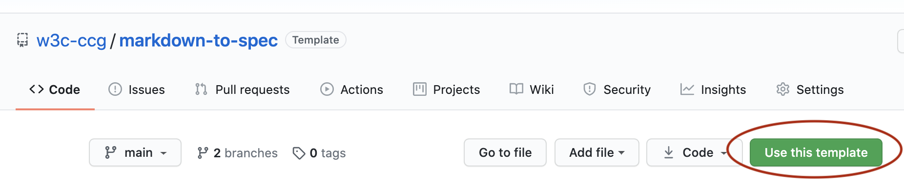
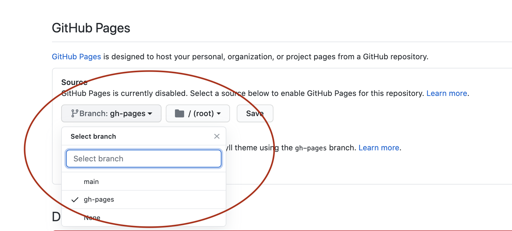

# markdown-to-spec
Markdown to spec template. 

This lets you write your specs in markdown, or technically [bikeshed](https://github.com/tabatkins/bikeshed) -- a markdown document, with special extensions understood by the bikeshed tool. The bikeshed tool is run on-commit via the [spec-prod github action](https://github.com/w3c/spec-prod), generating the familiar "spec looking" ReSpec format. ReSpec is just html with a javascript ReSpec library.

## Get started

1. Select "Use this template" and choose your repository

2. Go to Settings > Github Pages, and select `gh-pages` branch.

## Write your spec

Start editing your spec (note .bs file extension). The github action runs on commit to automatically convert to respec/html, via bikeshed. 

[Learn more about bikeshed](https://w3c-ccg.github.io/bikeshed_instructions.html)
