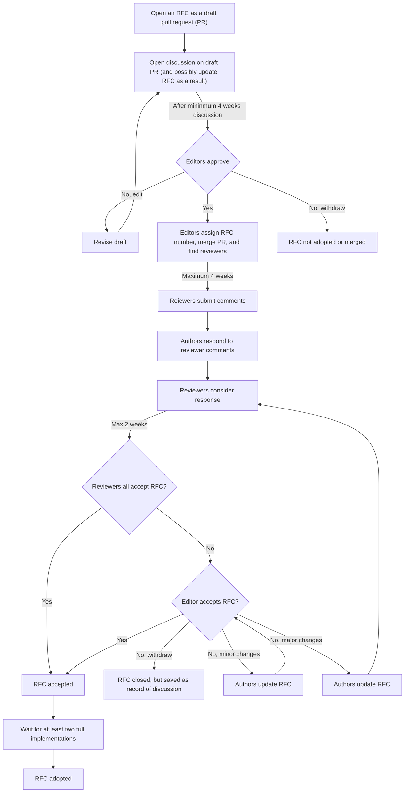

This document outlines the request for comment (RFC) process, which is used for suggesting discussing and adopting major changes to the OME-Zarr specification. RFC submissions are encouraged from anyone, and are recorded whether they are adopted or not.

Not all decisions need to follow the RFC process - this is intended primarily for significant and/or breaking changes to the specification or the community process itself. Other changes, bug fixes, etc. are welcome as PRs without a full RFC. If your are unsure whether or not a change requires an RFC, either open an issue or directly contact the OME-Zarr editor to check.

The majority of the process is currently derived from [RFC-1](https://ngff.openmicroscopy.org/rfc/1/index.html), but future RFCs may (and are encouraged) to update and improve this process.

## People involved

- **Authors** are the original creators of individual RFCs.
- **Endorsers** are non-Author supporters of an RFC.
- **Editors** are responsible for facilitating the RFC process. They identify whether a PR should or should not follow the RFC process, choose when a draft is ready to become an RFC, choose reviewers and manage communication between authors and reviewers. Their sole approval of an RFC (taking into account review comments) is one route to accepting it.
- **Implementers** create a software implementation of the RFC in one or more OME-Zarr library.
- **Reviewers** are invited by editors, provide comments on draft RFCs and their approval of an RFC is one route to accepting it.
- **Commenters** are others who provide feedback on RFCs.

## Process

A flowchart of the process is available at the end of this section.

### Phases

The overall RFC process is broken down into three phases: the _draft phase_ before a proposal becomes an RFC, the _RFC phase_ during which reviews occur, and the _accepted phase_ after the RFC has been accepted.

#### Draft

During the _draft_ phase, authors discuss and develop an idea to maximize its potential as an RFC. This phase is meant to circulate ideas and gather initial feedback, and authors may want to update the RFC based on discussions. Authors who are unsure if they will be able to shepherd an RFC throughout the entire process are still encouraged to open proposals that could be adopted by others during the RFC process.

This begins when an author opens a new draft pull request with their draft RFC, and lasts at least four weeks to allow anyone to leave comments or ask for clarifications. A [RFC template](templates/rfc_template) is available to start writing an RFC.

After four weeks, the editor can choose to assign an RFC number and merge the PR at which point it becomes an RFC, or can close it they believe there is no interest in progressing with the proposal. If the RFC is closed the editor will provide feedback on why this happened, which can be taken on board if authors wish to resubmit a similar idea in the future.

#### RFC

During the _RFC phase_, an iterative process of community endorsement and feedback helps to achieve a consensus decision on whether to adopt the RFC. Once a PR has been merged and has been assigned an RFC number, two conditions must be met for the RFC be adopted:

1. All invited reviewers approve the RFC, or in rare circumstances the editors decide to approve the PR.
2. Two pieces of software have started implemented the RFC.

Throughout the RFC phase feedback is welcome from anyone interested and who has read the RFC in full. Feedback can be given by adding a comment to the RFC, either by contacting the editors or directly opening a PR to add the comment to the NGFF repository. It is also possible to simply endorse a RFC, which amounts to approval with no feedback for improvement.

The editor also specifically invites reviewers to give feedback on proposals. The rest of this section explains the formal review process.

##### The review process

The editor will identify and assign reviewers. Editors and Reviewers should proactively disclose any potential conflicts of interest as part of the RFC process at this point to ensure a transparent review process. Reviewers will be asked to complete a review within four weeks. If keeping to this timescale is not possible, they should contact the editor so appropriate arrangements to extend the review period or find other reviewers can be made.

Reviewers then submit their comment along with their recommendation, either via a public PR adding the review in markdown to the RFC's subdirectory or by emailing the editor directly (a PR is preferred).

Possible recommendations from **Reviewers** in ascending order of support are:

- **Reject** suggests that the downsides of adopting an RFC outweigh the benefits, and there is no pathway to remedy this. This should be a last recourse, and instead major changes can be requested with positive suggestions for improvement.
- **Major changes** suggests an RFC has potential value of an requires significant changes before being adopted. Suggestions should be provided on how to concretely improve the proposal in order to make it acceptable and change the reviewer’s recommendation.

* **Minor changes** suggests that if the described changes are made reviewers consider the RFC acceptable.
* **Accept** is a positive vote with no requested changes and no text review is strictly necessary, though may be provided. Reviewers who accept an RFC are implicitly considered an endorser.

Reviewers who also maintain an implementation can also specify when recommending:

- “Plan to implement” with an estimated timeline
- “Implementation begun” with an estimated timeline
- “Implementation complete” with a link to the available code

Reviewers are free to structure the text in the most useful way - [a template](templates/review_template) is available but not mandatory Reviews should be cordial and professional. The goal is to communicate to the authors where RFCs can be improved before being adopted, or explain why an RFC should not be adopted.

Once editors have received reviews they are added to the NGFF repository alongside the RFC, authors are contacted for a response. At this stage authors can update the RFC in response to feedback to improve it. The response to reviewers should reply to each point and explain how they have resolved each comment. Editors then contact the reviewers again, who have the opportunity to revise their review in response to the author comments. This should be done within two weeks of authors replying to the original comments.

This stage can be iterative - if all reviewers return a formal "approve" review the RFC can be adopted as soon as there are two in-progress implementations. If the reviewers do not all approve, the editor can take one of three decisions:

- provide authors a list of necessary changes. These will be based on the reviewer suggestions but possibly modified, e.g., to remove contradictions. If the changes are minor the editors might decide that no further review is required.

* close the RFC . This should only be take if all reviewers recommend the RFC is rejected. Authors can re-submit the RFC in the future taking into account feedback shared during the review process.
* decide that no further changes are necessary and that the RFC should be adopted.

In the last case editors must provide a reply explaining why the decision of the reviewers was overridden. This might occur if consent between the reviewers cannot be reached.

If the changes requested by the editor are major, then the review process iterates again and the reviewers re-review after authors have updated the RFC.

In all cases, the RFC text and all reviews and comments remain available the RFC web page for posterity.

If at any stage in the process above, reviewers feel it necessary to raise an objection to the decisions by the editors, then the “Handling Disagreements” section below should be followed.

#### SPEC

During the _SPEC phase_ necessary changes to the specification and implementations are applied so that the RFC can be officially adopted. At this point the primary purpose of the RFC becomes driving implementations. Implementations may raise problems not foreseen during the review process. In this case implementers should engage directly with authors to resolve these queries. For complex RFCs this period may take substantial time to coordinate with implementers. Editors will also contact in-progress implementers regarding the status of their implementations and update the endorsements table accordingly.

Once two implementations are complete and released, the RFC is considered adopted 🎉

### RFC Prioritization

All RFCs are welcome from the community as a way to contribute to the public record of the ongoing evolution of OME-Zarr. That being said, not every RFC is guaranteed to get to the review stage due to people-time constraints. Priority will be given to RFCs which move the specification forward, followed by RFCs which address non-specification concerns of the community like the process itself.

### Choice of Reviewers

Where possible, reviewers will be chosen to represent a cross-section of the community. This might include geographic distributions, the variety of imaging modalities, and/or programming languages of the expected implementations. An attempt is also made to select a range of views from the community.

### Deadline enforcement

Everyone (and especially the editors) should try to prevent the specification process from becoming blocked or stalled. As part of this editors will:

- keep a record of all communications to identify bottlenecks and improve the RFC process
- frequently contact authors and reviewers regarding approaching deadlines
- find new reviewers when it becomes clear that the current slate is overextended
- and proactively mark RFCs as inactive if it becomes clear that progress has stalled

Authors and reviewers are encouraged to be open and honest, both with themselves and the other members of the process, on available time.

### Implementation requirements

Two separate implementations must have started for an RFC to enter the SPEC phase and two separate implementations (they need not, but can, be the same ones) must be released an RFC to be adopted. In both cases, at least one implementation must come from someone who is not among the RFC authors. Additionally, data written by both implementations must be readable (and therefore validatable) by at least one of the implementations. It is also strongly encouraged that for each specification change, the [ome-ngff-validator](https://github.com/ome/ome-ngff-validator) additionally be updated as a simple to use and widely used too for partial dataset validation. RFCs should provide guidance where possible for implementers on required and optional sections of an RFC.

### RFC Versions

RFCs may be edited, but this should only be done in extraordinary cases for:

- clarification: additional text and examples which simplify the implementation of specifications
- deprecation: where sections are no longer accurate and especially when they have been replaced by a new RFC, the existing text can be marked and a link to the updated information provided;
- and extension: references to new RFCs can be added throughout an existing RFC to provide simpler reading for implementers.

RFCs should clearly identify any sections which are anticipated to be deprecated or extended in the future.

### Handling Disagreements

The OME community is open to everybody and built upon mutual respect. All activities within the NGFF community are conducted under the OME [Code of Conduct](https://github.com/ome/.github/blob/master/CODE_OF_CONDUCT.md#when-something-happens). If you feel that your feedback is not being considered, please follow the steps outlined under “When Something Happens”.

### Editorial Board

The Editors can be reached at \<mailto:ngff-editors@openmicroscopy.org\>. Josh Moore is the current sole editor.
