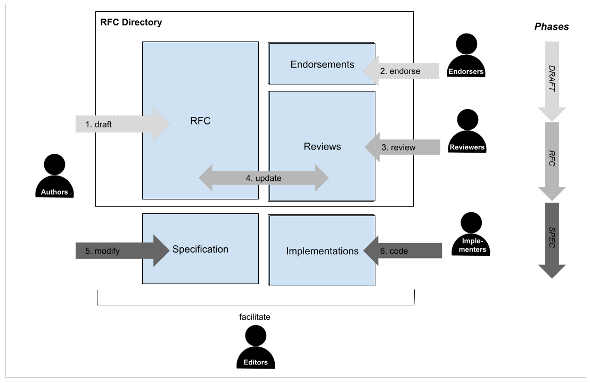

RFC-1: RFC Process
==================

Definition of the NGFF “Request for Comment” (RFC) process

```{toctree}
:hidden:
:maxdepth: 1
templates/index
reviews/index
comments/index
responses/index
versions/index
```

## Status

This RFC is currently being responded to (R4).

```{list-table} Record
:widths: 8, 20, 20, 20, 15, 10
:header-rows: 1
:stub-columns: 1

*   - Role
    - Name
    - GitHub Handle
    - Institution
    - Date
    - Status
*   - Author
    - Josh Moore
    - [joshmoore](https://github.com/joshmoore)
    - [German BioImaging, e.V.](https://ror.org/05tpnw772)
    - 2023-12-23
    - Author ([PR](https://github.com/ome/ngff/pull/222)) 
*   - Reviewer
    - Davis Bennett, John Bogovic, Michael Innerberger, Mark Kittisopikul, Virginia Scarlett, Yurii Zubov
    - d-v-b, bogovicj, minnerbe, mkitti, virginiascarlett, yuriyzubov 
    - Janelia
    - 2024-02-26
    - [Review](./reviews/2/index)
*   - Reviewer
    - Kevin Yamauchi, Virginie Uhlmann
    - kevinyamauchi, vuhlmann
    - ETH, BiovisionCenter
    - 2024-03-05
    - [Review](./reviews/1/index)
*   - Reviewer
    - Matthew Hartley
    - mrmh2
    - EMBL-EBI
    - 2024-03-05
    - [Review](./reviews/3/index)
*   - Commenter
    - Wouter-Michiel Vierdag, Luca Marconato
    - melonora, LucaMarconato
    - EMBL
    - 2024-01-13
    - [Comment](./comments/1/index)
*   - Commenter
    - Matt McCormick
    - thewtex
    - ITK
    - 2024-01-09
    - [Comment](./comments/2/index)
*   - Author
    - Josh Moore
    - joshmoore
    - German BioImaging
    - 2024-08-29
    - [Response](./responses/1/index)
*   - Endorser
    - Jean-Marie Burel
    - jburel
    - University of Dundee
    - 2024-09-09
    - [Endorse](https://github.com/ome/ngff/pull/258)
*   - Endorser
    - Will Moore
    - will-moore
    - University of Dundee
    - 2024-09-09
    - [Endorse](https://github.com/ome/ngff/pull/258)
*   - Endorser
    - Juan-Nuñez Iglesias
    - jni
    - Monash University
    - 2024-09-09
    - [Endorse](https://github.com/ome/ngff/pull/258)
*   - Endorser
    - Norman Rzepka
    - normanrz
    - scalable minds GmbH
    - 2024-09-09
    - [Endorse](https://github.com/ome/ngff/pull/258)
*   - Endorser
    - Jan Eglinger
    - imagejan
    - FMI Basel
    - 2024-09-09
    - [Endorse](https://github.com/ome/ngff/pull/258)
*   - Endorser
    - Joel Lüthi
    - jluethi
    - BioVisionCenter, University of Zurich
    - 2024-09-10
    - [Endorse](https://github.com/ome/ngff/pull/258)
```

## Overview

This RFC defines the high-level decision making process for changes within the
NGFF community. These changes are defined in "Request for Comments" (RFCs) and
therefore this RFC is self-referential: it is following the process that it
itself defines.

## Background

Growing interest in the NGFF format has also led to increased participation in
the specification process. As such, reaching a consensus for all decisions has
become more difficult. The current approach defined _post facto_ in RFC-0
follows a full consensus model. Through community meetings and pull requests,
it was expected that all parties agree before a specification change was
considered. This made it especially difficult both for those proposing as well as those reviewing changes to know when a suggested change was adopted since PR comments
could re-open a discussion. It also left a significant burden on maintainers to
draw a line where further discussion was not possible. Such a situation leads
to slower specification evolution and potential deadlocks.

Additionally, extended GitHub discussions had become difficult to follow. Without some curation of the content, it was unclear to those not deeply involved from the beginning to see what decisions had been made, by whom, when and why. There were also limited options for managing the often complex conversions and differing opinions that arise in technical conversations.

Led by the need to take on larger challenges and more interested parties, there
has been significant interest within the community to update the process used
in order to bypass these issues. This RFC adapts the well-known [RFC process](https://www.rfc-editor.org/),
which originated in the Internet Engineering Task Force (IETF), for use in the
NGFF community as has been done in a number of other communities ([Rust](https://github.com/rust-lang/rfcs/blob/master/0000-template.md),
[Hashicorp](https://works.hashicorp.com/articles/rfc-template), [Tensorflow](https://github.com/tensorflow/community/blob/master/rfcs/yyyymmdd-rfc-template.md), etc.) More information can be found under:

- [https://en.wikipedia.org/wiki/Internet\_Standard#Standardization\_process](https://en.wikipedia.org/wiki/Internet_Standard#Standardization_process)
- [https://en.wikipedia.org/wiki/Request\_for\_Comments](https://en.wikipedia.org/wiki/Request_for_Comments)

## Proposal

Requests for Comment (RFCs) are intended to structure high-level discussions on changes within the NGFF community and record outcomes including key opinions, actions, and decisions. The overall goal of the process is timely and transparent decision-making for a stable and trusted community specification. It should be clear after reading the RFC which stakeholder (**Author**, **Reviewer**, **Editor**, etc.) is responsible for each step of the process, what options are available to the decision makers,  and how much time the community can expect that decision to take.



**Figure 1.  Simplified drawing of the RFC process** An RFC draft (1) is
proposed by **Authors** who would like to see some change in the NGFF
community. There is a period of gathering _[endorsements](#def-endorsement)_
(2) which will be listed in the RFC itself. This gives future readers and
especially those tasked with _implementing_ any changes more confidence in the
proposal itself. Once any necessary clarifications have been addressed,
**Editors** will assign the RFC a number and send it to **Reviewers** for
detailed responses (3). These are captured in the RFC directory. **Authors**
will then update the RFC with any needed changes and provide a _response_ to
the **Reviewers** (4). Once this iterative process of review is complete, the
RFC will either be approved or not. Once approved, the specification is updated
with the RFC changes (5). After a minimum number of implementations have been
achieved, the RFC is considered _adopted_ (6).

The RFC process functions by encouraging submissions from the
community that are recorded for posterity *even if not adopted*. 
Descriptive and complete comments from both **Authors** and **Reviewers** are critical
to have a clear understanding of what decisions have been made.
Goals of this process include maintaining a public record of
the decision making, querying endorsement of a proposal throughout the
process and making that readily visible, and ultimately driving the
implementation of specifications in order to get working solutions into the
hands of the bioimaging community. The process should **NOT** prevent future
discussions on any adopted RFCs but instead will encourage continued
improvement and evolution through discussions of _further_ RFCs.

Additionally, not all decisions in the NGFF community need to follow the RFC process. Clarifications, corrections, and numerous other changes will proceed following the current GitHub workflow. However, when decisions reach a certain scale, including significant specification changes but also changes to the community process itself, RFCs will provide a mechanism for managing the process.

## Requirements

The key words "MUST", "MUST NOT", "REQUIRED", "SHALL", "SHALL NOT", "SHOULD",
"SHOULD NOT", "RECOMMENDED", "MAY", and "OPTIONAL" in this document are to be
interpreted as described in IETF [RFC 2119](https://datatracker.ietf.org/doc/html/rfc2119).

## Stakeholders

This section lists the major stakeholders in the RFC process and provides an
overview of their responsibilities and involvement in the process. For more
details, see the "Implementation" section below.

**Authors** propose an idea for the RFC process and socialize the idea, e.g.,
through an issue or community call, gaining **Endorsers.** They then submit a
pull request to the [https://github.com/ome/ngff](https://github.com/ome/ngff) repository with a document that
they would like to have published as an RFC. This pull request MUST contain a
document under the `rfc/` subdirectory and it SHOULD follow the template
provided. As described under the "DRAFT" section below, this document can be
discussed for clarity following the standard PR process. However, once the
draft has reached a stage where it is ready for review, **Editors**
will merge it as a record of the fact that the suggestion has been made, and
it will then become available on https://ngff.openmicroscopy.org.

**Endorsers** are non-**Author** supporters of an RFC, listed in a table within the RFC. 
**Reviewers** who have given an "Accept" recommendation  and **Implementers** are also also considered **Endorsers**.

**Editors** are responsible for facilitating all parts of the RFC process.
They identify whether a PR should or should not follow the RFC process,
and choose when a draft is ready to become an RFC. They also choose
appropriate **Reviewers** for an RFC and manage the communication between
**Authors** and **Reviewers**. 

**Implementers** are responsible for an implementation of the NGFF specification in one or more programming languages. It is critical that specification RFCs have been evaluated by **Implementers** which is often best done in the implementation rather than a review. Therefore, statements that an RFC is “planned”, “begun”, or “complete” for an implementation will be given similar weight to an endorsement or positive review.

**Reviewers** represent experts in the community whose opinion on an RFC is
necessary in order for the community to feel comfortable that a solution is
advantageous for and implementable by the community. Some number of reviewers
will be asked to provide a review of the RFC along with a recommendation on how
the **Editors** should proceed with the RFC. Depending on the complexity of the
RFC, this process may be iterative and require multiple reviews. Rather than a process terminated with a single vote, the RFC process
consists of iterative rounds of gathering **Endorsers**, or sponsors, who
approve the work, building confidence that the community is moving in the
right direction. **Reviewers** should strive to provide feedback which informs **Authors** of the changes that are needed to reach acceptance. More information on this strategy can be found under:
[https://engineering.squarespace.com/blog/2019/the-power-of-yes-if](https://engineering.squarespace.com/blog/2019/the-power-of-yes-if) .

**Commenters** are other members of the community who, though not contacted as **Reviewers**, have provided feedback that they would like added to the official record of the RFC.

## Implementation

The RFC process can be represented as a state diagram with the various stakeholders (in bold) responsible for forward motion.


**Figure 2. State digram of the RFC process.** The RFC text will refer frequently to this diagram. Readers may want to familiarize themselves with it at this point.
Identifiers such as "D1", "R2", "S3", refer to individual steps.

### Legend

Notes regarding specific requirements are called out throughout the text
with the following symbols:

> * 🕑 The clock symbol specifies definitive wait times within the process.
> * 📂 The folder symbol specifies requirements on additions to the repository,
>   for example an implementation or failing test.

### Phases

The overall process is broken down into three phases: the DRAFT phase before a
proposal becomes an RFC, the RFC phase during which reviews occur, and the SPEC
phase after the RFC has been accepted.

#### DRAFT

**Purpose**: During the DRAFT phase, **Authors** discuss and develop an idea to maximize its potential as an RFC.

The DRAFT phase begins when **Authors** propose (D1) a new idea and
subsequently gather support (or "socialize") the idea (D2) before opening a PR
(D3) which SHOULD follow the [current template](templates/rfc_template.md).
This phase is meant to promote ideation without premature criticism, though
clarifications can be requested on the GitHub PR (D4) which may require an
update of the PR (D3). Note: the RFC process does not formally make use of GitHub's
"draft" state, though **Editors** MAY choose to ignore such PRs.

The RFC process is intended primarily for significant and/or breaking changes to
the specification or the community process itself, as described under
["RFC Prioritization"](#rfc-prioritization). Other changes, bug fixes,
etc. are welcome as PRs without a full RFC. If **Authors** are unsure whether
or not a change requires an RFC, they can open an issue or contact the **Editors**
directly.

Comments on how a specification is implemented or what could be proposed
instead from potential **Reviewers** and **Commenters** should come in the
RFC stage, and the **Editor** MAY postpone such discussions when appropriate.

> 🕑 The iterative clarification phase can be expected to take on the order of a month.

At the **Editors** discretion (D5), the PR can be merged at which point it
becomes an RFC or closed if there is no interest in progressing with the
proposal (D6). In the latter case, **Authors** can use any feedback to open a new PR
(D3). **Authors** who are unsure if they will be able to shepherd an RFC
throughout the entire process are still invited to open PRs so that they might
be adopted by other members of the community.

These steps are not significantly different from the previous consensus model
described in [RFC-0](../0/index). However, discussions during this
period are intended to improve the RFC and not to evaluate its
overall value. As described in the next section "RFC", the deeper and more
critical discussions should happen as complete and well-considered reviews
and responses that will help future readers understand the decision-making
process. To this end, **Editors** MAY state on GitHub that a question or
comment is "more appropriate for an official comment". This is not intended to
silence anyone but to manage the overall flow of discussion.

#### RFC

**Purpose**: During the RFC phase, an iterative process of community endorsement and/or feedback helps to achieve a consensus decision.

Once a PR has been merged and has been assigned an RFC number, **Editors** are responsible for
adjusting the "Status" in the RFC document to become "RFC phase (R1)", and
identifying and assigning **Reviewers** (R1). **Reviewers** will be given a
period of time for preparing their reviews. If they do not foresee being able
to respond in this time, they SHOULD contact the **Editors** as soon as
possible.

> 🕑 Reviewers comments SHOULD be returned in less than one month.

**Reviewers** then submit their comments (R2) along with their recommendations
to the **Editors**, either via a public PR adding the review in markdown to the
RFC's subdirectory or by emailing the **Editors** directly. (This latter course
should only be used when necessary.)

(rfc-recommendations)= Possible recommendations from **Reviewers** in ascending order of support are:

* “Reject” suggests that a **Reviewer** considers there to be no merit to an
  RFC. This should be a last recourse. Instead, suggestions in a “Major
  changes” recommendation might include attempting an Extension rather than an
  RFC so that not all implementations need concern themselves with the matter.
* “Major changes” suggests that a **Reviewer** sees the potential value of an
  RFC but will require significant changes before being convinced. Suggestions
  SHOULD be provided on how to concretely improve the proposal in order to make
  it acceptable and change the **Reviewer**’s recommendation.
* “Minor changes” suggests that if the described changes are made, that
  **Editors** can move forward with an RFC without a further review.
* “Accept” is a positive vote and no text review is strictly necessary, though
  may be provided to add context to the written record. This is equivalent to
  the **Reviewer** joining the list of endorsements.

Three additional versions of the "Accept" recommendation are available for
**Reviewers** who additionally maintain an implementation of the NGFF
specification to express further support:
* “Plan to implement” with an estimated timeline
* “Implementation begun” with an estimated timeline
* “Implementation complete” with a link to the available code

Where a review is required, **Reviewers** are free to structure the text in the
most useful way. A [template markdown file](templates/review_template)
is available but not mandatory. Useful sections include:

* Summary
* Significant comments and questions
* Minor comments and questions
* Recommendation

The tone of a review should be cordial and professional. The goal is to communicate
to the **Authors** what it would take to make the RFC acceptable.

Once **Editors** have received the recommendations and reviews (R3), they
should be added to the repository and the **Authors** should be contacted for a
response. **Authors** are invited at this stage (R4) to update the RFC document
via subsequent PRs. The response SHOULD include a written rebuttal to each of
the reviews. **Editors** include the response in the repository (R5) and
contact **Reviewers** to see if their recommendations have changed.

> 🕑 Authors responses to Reviewers should be returned to the Editors in less than two weeks.

(anchor-rebuttal-r6)= This brings a critical, and possibly iterative, decision point (R6).  If all **Reviewers** `approve` and there are no further changes needed, the RFC can progress to S1 as soon as there are two in-progress implementations. If the **Reviewers** do _not_ approve, then the **Editors** will make one of three decisions (R7):

* The **Editors** MAY provide **Authors** a list of necessary changes. These will be based on the **Reviewers** suggestions but possibly modified, e.g., to remove contradictions.
* The **Editors** MAY decide that the RFC is to be closed (R9). This is the decision that SHOULD be chosen if there is a unanimous `Reject` recommendation. The **Authors** MAY then decide to re-draft a new RFC (D2).
* Finally,  the **Editors** MAY decide that no further changes are necessary (S0).

If the **Editors** decide to override the recommendations of the **Reviewers** (R7) the **Editors** MUST include a response (S0). This may occur, for example, if consent between the reviewers cannot be reached. In the case of a unanimous `Reject`, the **Editors** SHOULD attempt to find at least one additional, approving **Reviewer** .

If the **Editors** decide that the changes requested of the **Authors** in R8 are minor, then no further review is necessary and the **Editors** will review any final modifications. (R7)

> 📂 Two in-progress implementations required for progressing to S1.

Otherwise, the RFC iterates through the process again. If the changes made by
the **Authors** are significant, **Reviewers** may be asked to respond again
(R2). Alternatively, **Editors** may send the text back to the **Authors** for
further refinement in order to achieve sufficient endorsement.

In all cases, the RFC text and all reviews and comments remain on the specification page for posterity.

If at any stage in the process above, **Reviewers** feel it necessary to raise an objection to the decisions by the **Editors**, then the “Handling Disagreements” section below should be followed.

Throughout the RFC phase, non-**Author** supporters of the RFC
are invited to contact the **Editors**, comment on the original PR, and/or open
a new PR to list themselves as **Endorsers** of the RFC. Whether or not the
**Endorser** has begun implementing the RFC is especially of relevance, both
to gauge the degree of confidence but also to allow **Editors** and **Authors**
to contact the **Endorser** regarding any breaking changes.

#### SPEC

**Purpose**: During the SPEC phase, necessary changes to the specification and implementations are applied so that the RFC can be officially adopted.

If an RFC enters the SPEC state via **Editors** approval (S0), an additional
explanation by the **Editors** will be included in the RFC's directory at which
point it is considered equivalent to a **Reviewer** accepted RFC. At this point
(S1), the primary purpose of the RFC becomes driving implementations. Further
clarifications (S2) may be needed. Updates to the RFC as well as the
specification itself will be managed by the **Authors** and the **Editors** in
coordination.

> 🕑 This period may take substantial time to coordinate with implementers,
> but should be limited to approximately a month if possible.

**Editors** will also contact remaining implementers (S3)
regarding the status of their implementations and update the endorsements table
accordingly.

Once sufficient endorsements, including two released implementations, are
listed, the specification will be considered "adopted". The adopted
specification will be slotted into a release version by the **Editors** and the
**Authors** are encouraged to be involved in that release.

>  📂 Two released implementations required for being adopted.

## Policies
This section defines several concrete aspects of the RFC process not directly related to the state diagram above. These policies are referred to by section title elsewhere in the document for clarification. They also provide extension points in RFC-1 which may later be amended by separate RFCs. If so, those sections will be marked as deprecated and a reference made to the new RFC.

### Decision-making
Unless otherwise specified in the text, the following considerations are taken
into account when making decisions regarding RFCs:
 - **prefer working examples**: whether an implementation of an RFC or a failing test which exposes an issue in a proposal, working examples will tend to carry more weight in decision making.
 - **technical expertise**: all other considerations being equal, feedback from stakeholders with more technical expertise in a matter under consideration will tend to carry more weight in decision making.
- **newcomer advantage**: care will be taken not to let existing implementations overly dictate the future strategic direction of NGFF in order to avoid premature calcification.

### RFC Prioritization
RFCs are welcome from the community as a way to contribute to the public record of NGFF. It is **not** a goal to explicitly limit the number of RFCs and they need not only include specification changes. (See [this list of RFCs](https://en.wikipedia.org/wiki/April_Fools%27_Day_Request_for_Comments) for comparison.)

That being said, not every RFC MUST be sent to **Reviewers**. Priority will be given to RFCs which move the specification forward followed by RFCs which address non-specification concerns of the community like the process itself.

### Choice of Reviewers
Where possible, **Reviewers** SHOULD be chosen to represent a cross-section of the community. Which cross-sections are chosen MAY depend on a given RFC but might include geographic distributions, the variety of imaging modalities, and/or programming languages of the expected implementations. An attempt MUST also be made to select both positive and negative voices from the community.

### Deadline enforcement

In the absence of concrete mechanisms for deadline enforcement (penalties, etc), all members of the NGFF community and especially the **Editors** SHOULD strive to prevent the specification process from becoming blocked.

The **Editors**, however will endeavor to:
* keep a record of all communications to identify bottlenecks and improve the RFC process;
* frequently contact **Authors** and **Reviewers** regarding approaching deadlines;
* find new **Reviewers** when it becomes clear that the current slate is overextended;
* and proactively mark RFCs as inactive if it becomes clear that progress has stalled.

**Authors** and **Reviewers** are encouraged to be open and honest, both with themselves and the other members of the process, on available time. A short message stating that an edit or a review will not occur on deadline or even at all is preferable to silence.

### Implementation requirements
The process description describes “sufficient endorsement” in two locations, once for when an RFC can move into the [SPEC phase](#spec) and once when it can be considered “adopted”. This policy describes the current definition of “sufficient”, which is currently kept minimal with an eye towards updating it in the future.

Under RFC-0, three implementation languages — Javascript, Python, and Java — were considered “reference”, or “required”, for a specification to be complete. This proved a difficult barrier since the implementation teams were not directly funded for work on NGFF.

RFC-1 has chosen to start with a simpler requirement: **two** separate implementations MUST be _begun_ to enter the SPEC phase and **two** separate implementations (they need not be the same ones) MUST be _released_ to be considered adopted. In both cases, at least **one** of those implementations MUST come from an **Implementer** who is not among the  **Authors**.  Additionally, data written by both implementations MUST be readable (and therefore validatable) by at least **one** of the implementations.

It is also strongly encouraged that for each specification change, the [ome-ngff-validator](https://github.com/ome/ome-ngff-validator) additionally be updated. The validator will not fully test the readability of a dataset since it has limited IO capabilities, but it is the most complete tool for validating the metadata associated with a dataset.

No implementation is currently considered “reference”, though **Editors** may decide that more implementations or a particular are required depending on the complexity of the RFC.

This policy does not yet specify whether parts of an RFC may be considered _optional_ and therefore omitted from implementations. RFC **Authors** SHOULD provide guidance where possible for **Implementers** on required and optional sections of an RFC until there is a normative policy.

### RFC Versions

The IETF RFC process disallows edits to published RFCs. (In the extreme case, a single word change has resulted in a new RFC number.) Though this ensures a unique interpretation of any RFC number, it would also lead to significant duplication of content and _churn_ in the NGFF community.

Though this decision may be reviewed in the future, RFCs MAY be edited, but **Editors** SHOULD limit modifications to _adopted_ RFCs only for:
- clarification: additional text and examples which simplify the implementation of specifications are welcome;
- deprecation: where sections are no longer accurate and especially when they have been replaced by a new RFC, the existing text can be marked and a link to the updated information provided;
- and extension: references to new RFCs can be added throughout an existing RFC to provide simpler reading for **Implementers**.

In writing RFCs, **Authors** SHOULD attempt to clearly identify sections which may be deprecated or extended in the future.

Before an RFC is _adopted_ there are a number of versions of an RFC which are produced during the editing and revision process. This RFC does not try to specify how those versions are managed. The **Editors** are encouraged to layout a best practice as described under “Workflow” that simplifies the review process. Possible solutions include:
* using commit numbers version
* making hard-copies of versions under review
* creating a separate repository per RFC
* opening a long-lived “review PR” with a dedicated URL

### Specification Versions
The semantics of versioning for the NGFF specification are not yet sufficiently well-defined. There is currently no clear definition of which parts of the specification, if
any, MUST be implemented by software projects. This has been handled in the
Zarr community by adding a "must understand" flag to extensions to warn
implementations that if they see a particular feature has been included, they
should fail rather than show the user incorrect data. Such a mechanism could
go hand in hand with an as-yet unspecified extension mechanism. This would be
an ideal topic for a following RFC, as well as the existence and handling of possible “development” and/or “long-term support” versions.

### Work Groups

Currently, there is a single "track" in the [process diagram](diagram.png) through which
all RFCs progress. This can initially be managed by careful choice of the
reviewers. However, as the complexity of review grows, it may become
advantageous to split the set of a reviewers into separate "tracks", such that
specific topic are handling by area experts. The process may also be modified
on a per track basis. For example, an information track which is largely for
training purposes and provides concrete examples to the community could have
an expedited process. A similar model is in use within the IETF community. If there is interest in establishing a dedicated working group, contact the [Editorial board](#editorial-board).

### Handling Disagreements

The OME community is open to everybody and built upon mutual respect. Nevertheless, disagreements do occur. 

All activities within the NGFF community are conducted under the OME [Code of Conduct](https://github.com/ome/.github/blob/master/CODE_OF_CONDUCT.md#when-something-happens). If you feel that your objections are not being considered, please follow the steps outlined under “When Something Happens”.

### Advisory Board

This proposal does not try to define higher-level governance and
conflict resolution. By default, as a repository within the "OME" GitHub
organization, the community health processes defined in
[https://github.com/ome/.github](https://github.com/ome/.github) hold for the NGFF process. However, following
this RFC, additional and specific governance mechanisms can be put in place for
the operation of the NGFF community process. This may or may not follow the
model of other RFC-using communities, e.g., IETF's [IAB](https://www.ietf.org/about/groups/iab/) or Fuchsia's
"governing authority".

### Editorial Board
The Editorial Board consists of all current **Editors** and can be reached at \<mailto:ngff-editors@openmicroscopy.org\>. Josh Moore, as the author of this RFC, is the sole initial member.

This proposal does not try to define how **Editors** are chosen. Therefore, the use of "Editors" in this document is intended as a placeholder. A future RFC will define the selection and removal of editors.

### Editorial Workflow
This proposal also does not define the day-to-day specifics of how **Editors** work. The [Editorial Board](#editorial-board) is encouraged to publish a separate document, e.g. Best Practice Guide, containing the daily or weekly workflow of managing the NGFF process. This document can be more quickly updated than the RFC and can contain updates to GitHub interactions (use of “draft” status, milestones, issues, etc.) and possible automation (reply bots and similar).

## Drawbacks, risks, alternatives, and unknowns
The primary **drawbacks**, **risks**, and **unknowns** of the proposal revolve
around the cost that the process will place on those participating in it. This
equally points to the primary **alternative** which is to not have such a
process, and "just use GitHub like any other open source project". The
experience of this RFCs author has been that solely relying on issues and PRs
on GitHub does not provide the editorial functions that one would want, such as
deferring and collecting comments, nor do the conversations provide a
consistent whole when revisited after the work on a specification.
Additionally, **Authors** have complained of the burden of managing responses.
So there's a need for *something*, but does this proposal go too far in the
other direction?

It is certainly true that the formality of the responses asked of the
**Authors** is beyond a typical PR, but the investment for the specifications
as of the writing of this RFC have already been significant, and the RFC
process especially helps **Authors** to structure and coordinate their
proposals. Similarly, the one **Editor** to date (and the author of this RFC)
has also struggled with the lack of an explicit process, and so that too is
likely less of an issue. Is the cost then too high for the **Reviewers**?

The hope is that by having clear expectations of the times involved in each
step, and following a model which is relatively known (reviewing for a journal)
that **Reviewers** will be better able to judge whether and how frequently they
can be involved. It also puts into place an editorial mechanism to handle the
situation where a **Reviewer** must leave the process early, allowing things to
continue to move forward.

Will the process be worth the effort? It's unclear. The fact that several other
communities have used variants of the process would imply that it can work. It
might be that we will have to update and further customize the process for the
NGFF community, but by having something explicit as in this RFC-1 it will make
it possible for us to more easily iterate.

## Abandoned ideas

As mentioned elsewhere in this document, the current consensus model of
decision making described in RFC-0 is one of the ideas that this RFC would
abandon. An alternative proposal that has been mentioned at various times is
that that someone, likely the Editor, "should just decide". This fiat model,
however, places too much burden on a single individual within the community.

Looking at the W3C community, there was little information on how each of the
separate working groups (HTML, XML, etc.) conducted their internal business.
Since this proposal intended to begin bottom-up, it was more useful to find a
working internal process like RFC. In the future, looking to the W3C for some
of the higher-level governance may make sense.

Another potential model described further under "Prior Art" is the "Enhancement
Proposal" model like ZEP. These models work quite similarly to the RFC model.
One major difficulty is that the name "NEP" is already in use by the Napari
community.

## Prior art and references

As mentioned in the "Background" section, there are a number of communities
using adaptions of the RFC process which will not be re-listed here. However,
there are also other enhancement processes which are closely related to the
NGFF RFC. Most closely, is the Zarr Enhancement Proposals (ZEP) process within
the Zarr community. Based originally on a combination of the PEP, NEP, and STAC
processes, the ZEP process uses a council of the implementations (ZIC) 

## Future possibilities

This RFC does not try to define all aspects of the NGFF community process and
instead focuses on the most immediate block which covers what is typically
thought of as the voting process. By establishing this as a foundation, future
RFCs can extend the community process either adding or simplifying structure as
feedback determines. In fact, sections like [“Policies”](#policies) are explicitly intended to be updated to reference future RFCs as they are defined.
The following items are therefore considered out of scope for the purposes of
this RFC but future work is intended to evolve the community process.

## Skipped sections

As a non-technical proposal, this RFC excludes the following optional headers: "Performance", "Backwards
Compatibility", "Security considerations", "Privacy considerations", "Testing",
"UI/UX".

## Definitions

Definitions for terms used throughout this RFC have been collected below.

(def-accepted)=
**Accepted**
: Specifies that an RFC has passed review and all implementers should begin
  implementation if they have not done so already.

(def-adopted)=
**Adopted**
: An RFC that has been sufficiently implemented to be considered
  as active within the community.

(def-author)=
**Author**
: Individual related in proposing an RFC. See ["Stakeholders"](#stakeholders)

(def-comment)=
**Comment**
: Documents that are included with the RFC discussing the pros and
  cons of the proposal in a structured way. Comments from reviewers are
  additionally referred to as "reviews".

(def-draft)=
**Draft**
: First phase of the RFC process. See the related section under “Implementation \> Phases”

(def-editor)=
**Editor**
: Facilitator of the RFC process. See “Stakeholders”

(def-endorsement)=
**Endorsement**
: public statement of support, made first on the forums or issue tracker and then recorded within the RFC itself, intended to increase confidence in a proposal.

(def-rfc)=
**RFC** ("Request for Comment")
: A formal proposal following a standardized
  template that is made to the NGFF repository. The proposal need not be
  accepted to be published online.

(def-pr)=
**PR**
: A pull request opened against the ome/ngff repository on GitHub.

(def-review)=
**Review**
: See Comment

(def-reviewer)=
**Reviewer**
: Community member invited to attach a more in-depth comment to an RFC. See “Stakeholders”

(def-zep)=
**ZEP ("Zarr Enhancement Proposal")**
: Decision-making process for the Zarr specification

## Changelog

| Date       | Description                  | Link                                                                         |
| ---------- | ---------------------------- | ---------------------------------------------------------------------------- |
| 2024-04-24 | Apply changes from comment 1 | [https://github.com/ome/ngff/pull/231](https://github.com/ome/ngff/pull/231) |
| 2024-08-30 | Apply changes from reviewers | [https://github.com/ome/ngff/pull/258](https://github.com/ome/ngff/pull/258) |
