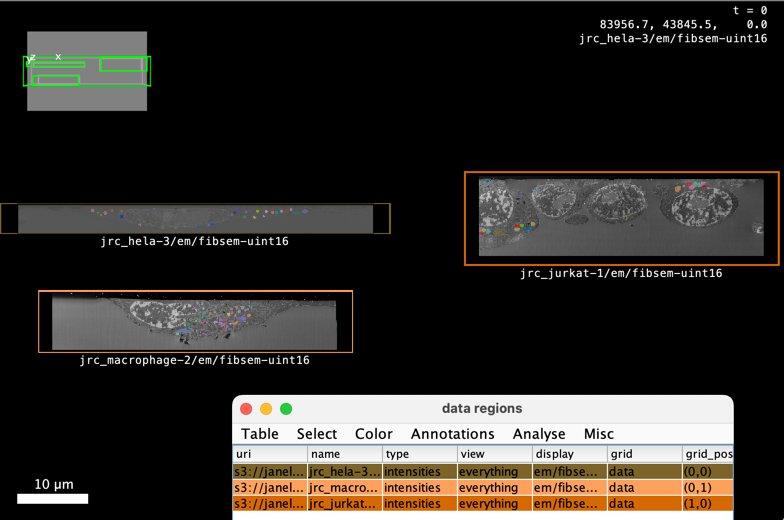

# RFC-8: Collections

Adding groupings of images and other objects to OME-Zarr.

## Status

This proposal is early. Status: D1

| Name      | GitHub Handle | Institution | Date       | Status                                |
| --------- | ------------- | ----------- | ---------- | ------------------------------------- |
| Norman Rzepka | [normanrz](https://github.com/normanrz) | scalable minds | 2024-11-20 | Author |
| Eric Perlman | [perlman](https://github.com/perlman) | Yikes LLC | 2024-11-20 | Author |
| Joel Lüthi | [jluethi](https://github.com/jluethi) | BioVisionCenter Zurich | 2024-11-20 | Author |
| Lorenzo Cerrone | [lorenzocerrone](https://github.com/lorenzocerrone) | BioVisionCenter Zurich | 2024-11-20 | Author |
| Johannes Soltwedel | [jo-mueller](https://github.com/jo-mueller) | German BioImaging e.V. | 2025-10-28 | Author |
| Christian Tischer | [tischi](https://github.com/tischi) | EMBL | 2025-02-01 | Author |
| Matthew Hartley | [matthewh-ebi](https://github.com/matthewh-ebi) |  EMBL-EBI | 2025-05-05 | Author |

<!-- 
| Author    | N/A           | N/A         | xxxx-xx-xx | Author; Implemented (link to release) |
| Commenter | N/A           | N/A         | xxxx-xx-xx | Endorse (link to comment)             |
| Commenter | N/A           | N/A         | xxxx-xx-xx | Not yet (link to comment)             |
| Endorser  | N/A           | N/A         | xxxx-xx-xx | Endorse (no link needed)              |
| Endorser  | N/A           | N/A         | xxxx-xx-xx | Implementing (link to branch/PR)      |
| Reviewer  | N/A           | N/A         | xxxx-xx-xx | Endorse (link to comment)             |
| Reviewer  | N/A           | N/A         | xxxx-xx-xx | Requested by editor                   |-->

## Overview

This proposal adds a new "collection" concept to OME-Zarr.

- Collections can be used to group together images, including segmentations, prediction maps and other derived images as well as other data types ("nodes"). 
- Collections can be nested. 
- Collections can have metadata attached. Within collections, nodes can also have metadata, which complements or overrides the nodes' own metadata.
- Nodes within collections are referenced by paths instead of relying on a file system hierarchy. Paths may also be absolute and point to remote storage.

This proposal does not aim to invent new concepts, but unify approaches that the community has already adopted, in a standards-compliant and extensible manner.

<!--
The RFC begins with a brief overview. This section should be one or two
paragraphs that just explains what the goal of this RFC is going to be, but
without diving too deeply into the "why", "why now", "how", etc. Ensure anyone
opening the document will form a clear understanding of the RFCs intent from
reading this paragraph(s).

-->

## Background

### The Why
* **Viewing**. Many viewers need to visualize multiple images at the same time. There is no generic way of defining this group of images.
* **Discoverability**. Zarr doesn't have a way of discovering groups within a group, which requires file system scans to discover images within a group.
* **Unifying concepts**. OME-Zarr has a few collection types already, e.g. high-content screening, bioformats2raw.layout. This is an opportunity to unify them.
* **Extensibility**. OME-Zarr does not have representations for adding other objects, e.g. tables, meshes, to a hierarchy. Through new metadata, collections offers a path to add new object types.
* **Metadata**. Collections allow to attach metadata to images or other objects without altering the original object (think: overriding). While this proposal does not specify the semantics of such metadata, it provides means for storing them.

### User stories

#### 1. Visualize multiple images at once
Several viewers are capable of visualizing multiple images, that can map to a common coordinate space, at once. Examples are Webknossos, Neuroglancer, MoBIE and OMERO.figure. All of these tools have developed their own JSON-based metadata to combine multiple images in a collection, see "[Prior art and references](#prior-art-and-references)". In addition to mere path references of the images, this metadata also contains information about coordinate transforms and rendering settings.

As there is no standard-compliant way in OME-Zarr to describe multiple images in one entity, users need to copy multiple links to interoperably visualize multiple images.

#### 2. m:n segmentations
While OME-Zarr has support for attaching labels to images, the support is not sufficient for many use cases.
There are multiple label images that can be attached to a single image. This is a 1:n relationship. However, m:n relationships would be desired because labels might be related to multiple images. Examples for that are:
- Multiple correlated images express the same feature that is being labeled.
- Channels are stored in multiple images instead of in the same image.

Additionally, there are other types of derived images, such as prediction maps, which cannot currently be represented by OME-Zarr. In comparison to label maps, where each voxel is assigned a discrete ID, prediction maps have a channel per segmentation class (or similar) and each voxel is assigned a probability or other continuous value.

#### 3. Shallow copies of images with segmentations
Many workflow engines operate by taking input images and producing output images. In many cases, it is desired to keep the input images unchanged.
Let's assume the example of a pixel classification task. This task would take an OME-Zarr image as input and produce a prediction map. To express the relationship between input image and output prediction, the task could create a collection that contains the prediction and links to the image (i.e. shallow copy). The output collection could then be used to visualize both at the same time. This is applicable to a wide variety of workflow tasks with the result that the outputs of each task can be visualized or further processed independent of other tasks.

```
├─ input_image.zarr
│  ├─ zarr.json # OME-Zarr multiscale
│  ├─ 0 
│  └─ ... 
└─ output_collection.zarr
   │  # includes collection metadata and link to "../input_image.zarr"
   ├─ zarr.json 
   └─ prediction.zarr
      ├─ zarr.json # OME-Zarr multiscale
      ├─ 0 
      └─ ...
```

Examples for such workflow systems:
- [Voxelytics](https://voxelytics.com)
- [Fractal](https://fractal-analytics-platform.github.io/)
- [Nextfow](https://www.nextflow.io/)

#### 4. Correlative imaging

Several applications in microscopy and other imaging domains involve the acquisition of images
of the same object from different angles or with different imaging modalities.
Examples of such applications are (among others) the following:
- Correlative light and electron microscopy (CLEM): In this case,
  a sample is examined with both electron and light microscopy,
  both of which feature their own sets of spatial dimensions.
  A set of coordinate transformations is used to map between the different images.
- Multiview lightsheet: For this application,
  lightsheet microscopes acquire multiple views of the same object from different angles.
  A set of coordinate transformations is used to map between the different views.
- Multimodal medical imaging: Different imaging modalities (e.g., CT, MRI, PET, etc),
  are often used either in conjunction or at different timepoints to observe the same object or anatomical structure. 

Such applications require the storage of collections of images and their mutual relationships,
the metadata for which has already been defined by RFC-5 (Coordinate Transformations in OME-NGFF).
In the context of RFC-5, images are part of a collection if they share a common coordinate space
that is defined by coordinate systems and coordinate transformations.
Since the relationships between images are already defined
in a graph-like schema as proposed in this RFC,
the transformations metadata can be represented as a specialized collection
with coordinate systems and transformations as attributes of the collection and nodes.
In a way, coordinate transformations and systems simply become a subset of the more general collection concept.


#### 5. High Content Screening (HCS) plates
(hcs-plates-collection)=
OME-Zarr high content screening plates are a current example of a very narrowly defined type of collection. They allow to group OME-Zarr images in multiple hierarchy levels: A plate contains wells, which are organized as row folders with column subfolders in each. Each well folder can contain a number of images. There is defined metadata about which wells are in a plate and about which images are in a well at the different hierarchy levels, typically with some additional optional metadata like the acquisitions that exist in a plate and which image belongs to which acquisition.
This hierarchy is very useful for typical experiments where researchers imaged a multi-well plate. Multiple viewers like MoBIE, napari & ViZarr support displaying the different wells arranged in the plate format given the OME-Zarr HCS metadata, thus avoiding the need for tool-specific metadata and showing the benefits of such collection concepts.
The current HCS spec also has its limitations: It has a strict definition of potential metadata fields at the plate and well level. There are multiple areas where it would be interesting to extend this spec. There are [ongoing discussions](https://github.com/ome/ngff/pull/137) about whether individual microscope fields of view (ie. well) should be stored as individual OME-Zarr images or as a single OME-Zarr image. In that context, it is unclear how one would provide metadata about the individual images in a well and what a viewer should do with them. For example, depending on whether an OME-Zarr image in a well is an individual field of view of a given acquisition, a second acquisition of the same region in a plate or an image derived from a given processing operation, the optimal viewer default on whether to show or not show multiple images at once will vary. A flexible metadata field like `attributes` would allow us to better define such image metadata. A more flexible HCS collection system could also allow to provide advanced metadata on well positions [when wells have different sizes](https://github.com/ome/ome-zarr-py/issues/240) or address other edge-cases in the current HCS configuration.


#### 6. Image Archive
Data archives that support deposition and access to OME-Zarr formatted images have two primary use cases for collections of images. For the first, users submitting data to deposition databases need ways to aggregate collections of images in their data upload structure, and do so in a way that supports describing how those images relate (e.g. parts of the same acquisition series, plate/well data as mentioned above). This can then be parsed during data submission, and used to create appropriate database records.

Secondly, when providing outgoing access to data, archives want to provide groupings of images that allow compatibility with data exploration and visualisation tools. Given the increasingly rich ecosystem of these tools (mentioned across these use cases, and including grid views, segmentations, multiple images and plate/well data) standardisation is necessary to avoid the need to produce view/exploration schema for each tool.

#### 7. Rendering settings
Viewers, such as Webknossos, Neuroglancer, MoBIE and OMERO.figure, are capable of visualizing multiple OME-Zarr images ("layers") in a view.
To share such a view, metadata serialization is required that contains not only links to the images, but also attached metadata of the rendering state.
The rendering state of a collection might contain locations, rotation angles, coordinate systems as well as rendering state of individual layers.
The rendering state of layers might contain pixel transformations (e.g. min/max scaling, colors, shaders), coordinate transformation overrides, visibility settings.

Some of these rendering state attributes might be compatible across implementations, but others might not.
This proposal does not intend to provide a specification for the rendering state itself, but provide metadata containers to store such viewer-specific state.


#### 8. Grouping together remote images

When building upon images that have been published by others, it might be useful to create virtual groupings of multiple remotely stored images.
For example, a lab might create automatic segmentations of a large image that has been published by another lab.
While the segmentation would now be published on its own, it could still be published with a link to the original images so that viewers are able to show the segmentation as an overlay on the original data.

#### 9. Adding other datatypes to images
When processing images in the OME-Zarr format, a diversity of derived data like segmentation, probability maps, meshes, tables and other formats can be generated. This proposal does not intend to provide a specification to all these datatypes, but to define the metadata of how related data in Zarr or other formats can be linked to OME-Zarr images.

Because there is already a specification for labels in the spec, the label definition is broadened by this spec. For other datatypes like tables, [past proposals](https://github.com/ome/ngff/pull/64) have focused on how tables can be serialised to OME-Zarr. As these proposals did not proceed to become part of the OME-Zarr spec, different implementers have built their own sub-specs for tables (see e.g. the [ngio table definition](https://fractal-analytics-platform.github.io/ngio/v0.3.2/table_specs/overview/) coming from the Fractal project or the [label table](https://mobie.github.io/specs/mobie_spec.html#table-data) in MoBIE). While future proposals and extensions may define datatypes like tables more strictly, this proposal offers a general way to make such additional data types discoverable.

#### 10. Gallery / grid views

It is useful to visualise similar images in a grid view where all images are visible as "thumbnails", which in the case of OME-Zarr can simply be the lowest resolution version of the data. Like this, users can have an overview of all the data and can then decide to "zoom in" on some datasets to explore them in higher resolution.

Implementations of this concept include:
- [Zarrcade](https://github.com/JaneliaSciComp/zarrcade)
- [BioFile Finder](https://bff.allencell.org/)
- [MoBIE grid views](https://mobie.github.io/tutorials/image_grids_and_tables.html)
- [OME2024 NGFF challenge](https://ome.github.io/ome2024-ngff-challenge/)

For example, [this table](https://docs.google.com/spreadsheets/d/1t5xB0p0zd2-a6ynV-JAuLJqs-mg-pFFikhfmQGZwRpI/edit?usp=sharing) defines a MoBIE grid view of three OpenOrganelle vEM images along with label images of mitochondria segmentation. It can be opened in MoBIE via the "Open Simple Collection Table" menu entry: 




<!--
The next section is the "Background" section. This section should be at least
two paragraphs and can take up to a whole page in some cases. The \*\*guiding goal
of the background section\*\* is: as a newcomer to this project (new employee, team
transfer), can I read the background section and follow any links to get the
full context of why this change is necessary? 

If you can't show a random engineer the background section and have them
acquire nearly full context on the necessity for the RFC, then the background
section is not full enough. To help achieve this, link to prior RFCs,
discussions, and more here as necessary to provide context so you don't have to
simply repeat yourself.

-->

## Proposal

<!--
The next required section is "Proposal". Given the background above, this
section proposes a solution. This should be an overview of the "how" for the
solution, but for details further sections will be used.
-->

This proposal adds collections to the OME-Zarr specification.
"Collections" are groupings of "nodes".
Nodes either reference OME-Zarr images (multiscales, singlescales) or collections.
Nested collections and multiscales can be inlined in the metadata.
Nodes reference images or collections that are stored locally relative to the collection or remotely (using URLs).
Arbitrary user or implementation metadata may be added to collections or nodes, which is an opportunity to add metadata that is only valid for a node in the context of a collection (e.g. rendering settings).
Images may be added as nodes to multiple collections.

### Goals

- Define a mechanism for grouping images into (hierarchical) collections
- Define a mechanism for referencing components of a collection (nodes, coordinate systems etc) internally and externally
- Add extensibility to collections for user/implementation-specific metadata and new node types
- Make a new home for HCS, bioformats2raw.layout and labels metadata
- Incorporate coordinate systems and transformations


### Metadata

#### `Node`

This RFC defines a basic interface for a OME-Zarr metadata object, which we name `Node`.
Objects that implement `Node` have the following fields:

| Field | Type | Required? | Notes |
| - | - | - | - |
| `"type"` | string | yes | Identifies the type of the node |
| `"id"` | string | no | Value MUST be a string that matches `[a-zA-Z0-9-_.]+`. IDs MUST be unique within the JSON document. |
| `"name"` | string | yes | Value MUST be a non-empty string. It SHOULD be a string that matches `[a-zA-Z0-9-_.]+`. Names MUST be unique within the enclosing collection. |
| `"attributes"` | object | no | [See attributes section](#attributes) |

The `type` field of a `Node` defines the additional fields, if any, it has. 
This RFC defines three `Node` types: `Collection`, `Multiscale`, and `Singlescale`.
Future RFCs might add more Node types, including custom Node types.

A `Node` object may be used as the root object of the `ome` key, in which case a `version` field, as defined in previous spec versions, is also required.
Non-root `Node` objects SHOULD NOT have a `version` field and MUST NOT have a different `version` value than the root `Node`.

#### `Collection` Node

References a `Node` that is a collection of `Node`s. 
Collections MAY be nested.

| Field | Type | Required? | Notes |
| - | - | - | - |
| `"type"` | string | yes | Value MUST be `"collection"`. |
| `"id"` | string | no | Value MUST be a string that matches `[a-zA-Z0-9-_.]+`. IDs MUST be unique within the JSON document. |
| `"name"` | string | yes | Value MUST be a non-empty string. It SHOULD be a string that matches `[a-zA-Z0-9-_.]+`. Names MUST be unique within the enclosing collection. |
| `"nodes"` | array | no | Value MUST be an array of `Node` objects. |
| `"path"` | object | no | Value MUST be a `Path` object. |
| `"attributes"` | object | no | Value MUST be a dictionary. [See attributes section](#attributes). |

Either `"nodes"` or `"path"` MUST be present, but not both.

#### `Multiscale` Node

References a `Node` that represents an OME-Zarr multiscale image.
This new interface replaces the multiscale metadata defined in the previous versions of the OME-Zarr specification.

| Field | Type | Required? | Notes |
| - | - | - | - |
| `"type"` | string | yes | Value MUST be `"multiscale"`. |
| `"id"` | string | no | Value MUST be a string that matches `[a-zA-Z0-9-_.]+`. IDs MUST be unique within the JSON document. |
| `"name"` | string | yes | Value MUST be a non-empty string. It SHOULD be a string that matches `[a-zA-Z0-9-_.]+`. Names MUST be unique within one collections JSON file. |
| `"nodes"` | array | no | Value MUST be an array of `Singlescale` objects. |
| `"path"` | object | no | Value MUST be a `Path` object. |
| `"attributes"` | string | no | Value MUST be a dictionary. [See attributes section](#attributes). |

Either `"nodes"` or `"path"` MUST be present, but not both.


#### `Singlescale` Node

References a `Node` that represents one resolution representation of an OME-Zarr multiscale image.
This new interface replaces the multiscale metadata defined in the previous versions of the OME-Zarr specification.

| Field | Type | Required? | Notes |
| - | - | - | - |
| `"type"` | string | yes | Value MUST be `"multiscale"`. |
| `"id"` | string | no | Value MUST be a string that matches `[a-zA-Z0-9-_.]+`. IDs MUST be unique within the JSON document. |
| `"name"` | string | yes | Value MUST be a non-empty string. It SHOULD be a string that matches `[a-zA-Z0-9-_.]+`. Names MUST be unique within one collections JSON file. |
| `"path"` | object | no | Value MUST be a `Path` object. |
| `"attributes"` | string | yes | Value MUST be a dictionary. [See attributes section](#attributes). |

`Singlescale` nodes MUST have a `coordinateTransformations` key in their `attributes` which conforms to the [coordinate transformations](#coordinate-transformations) specification and only contains `scale` and `translate` transformations.

If the `Singlescale` node is the root node and contained within the `zarr.json` of a Zarr array, the `path` field SHOULD NOT be present. 
In this case, the `Singlescale` describes the Zarr array.
Otherwise, the `path` field MUST be present.

#### `Path`

This new interface replaces the paths defined in the previous versions of the OME-Zarr specification.

| Field | Type | Required? | Notes |
| - | - | - | - |
| `"type"` | string | yes | Value MUST be valid path type. |
| `"path"` | string | yes | Value MUST be a string containing a path. See below. |

The `type` field defines how the path is interpreted. Currently, the `zarr` and `json` types are supported. 
The `"zarr"` type is used for paths that reference nodes in a Zarr array or group. Implementations need to append `zarr.json` to the path to access the metadata of the referenced node.
The `"json"` type is used for paths that reference nodes in a JSON file.

This `path` strings can be one of the following types:

- **Relative paths.**
  To reference nodes that are on the same file system namespace as the json file describing the collection, relative paths may be used.
  Relative paths are interpreted relative to the json file describing the collection.
  Relative paths follow the relative path notation defined in [IETF RFC1808](https://datatracker.ietf.org/doc/html/rfc1808).
  Briefly, `.` and `..` are used to navigate the hierarchy and the hierarchy is separated by `/`.
  Relative paths may be used for data stored on traditional file systems as well as other storage protocols, such as HTTP or S3.
- **Absolute file paths.**
  On traditional file systems, absolute paths may be used.
  Please note that absolute file paths are generally not portable across operating systems or file systems.
  - On Windows systems, paths commonly begin with a drive letter followed by `:\`. The folder hierarchy is separated by `\`. UNC paths are also permissible.
  - On POSIX-like systems, paths commonly start with a `/` and the folder hierarchy is separated by `/`.
- **HTTP(S) URLs.** 
  To reference nodes that are stored remotely, URLs with the `http` or `https` scheme may be used.
  URLs follow the notation defined in [IETF RFC1738](https://datatracker.ietf.org/doc/html/rfc1738).

Future RFCs may propose additional paths, such as S3 URLs or chained paths (e.g. for referencing files within a zip file).
In any case, implementations may impose access restrictions on any type of paths.


#### References

Objects that are being referenced MUST have an `id` field.

The reference can be a string with an ID for referencing objects within the same JSON document.
For more complex references, the reference can be an object with the following fields:

| Field | Type | Required? | Notes |
| - | - | - | - |
| `"id"` | string | yes | Value MUST be a string that matches `[a-zA-Z0-9-_.]+`. |
| `"path"` | object | no | Value MUST be a `Path` object. |

For external references, the `path` field MUST be present.


#### Attributes

Each `Node` has an `attributes` field that can be populated with JSON metadata.
A primary use case for the `attributes` field is the specialization of collections and nodes through additional metadata.

Attribute keys follow the naming scheme described in [Extensibility](#extensibility): unprefixed keys are reserved for the core specification, while prefixed keys (e.g., `mobie:`, `neuroglancer:`, `fractal:`, `webknossos:`) allow custom metadata.

Custom-prefixed keys can also be used to add additional sub-keys or behavior to existing unprefixed keys.
This can be thought of as a way of achieving inheritance.
For example, the `well` key could be specialized by a `fractal:well` key that adds additional sub-keys or alters behavior.
It is out-of-scope of this RFC to fully define the inheritance behavior.
That is left to be defined on a case-by-case basis for individual key specifications and may be standardized in a future RFC.

Unprefixed attribute keys that are defined as part of this RFC are:
- `coordinateSystems`
- `coordinateTransformations`
- `labels`, as well as `label-value` and `color` in label attributes
- `plate` and `well`

### Extensibility

Adding collections to OME-Zarr provides an opportunity to define extension points.
Extension points allow the specification to be extended in a controlled manner, enabling custom functionality while maintaining interoperability.

#### Naming scheme

Extension identifiers follow a prefixed vs unprefixed convention:

- **Unprefixed identifiers** are reserved for the core specification and can only be added or modified through the RFC process.
- **Prefixed identifiers** (separated by `:`) can be freely introduced by custom extensions without requiring an RFC. The prefix identifies the user or organization that introduces and maintains the extension. Prefixes SHOULD be registered in a central registry (a Github repository under the `ome` organization). Registration of a prefix claims maintainership for that prefix and provides a discoverable location for the specification of custom extensions.
- The `ome:` prefix is reserved for official extensions that have not yet been incorporated into the core specification.

This naming scheme applies uniformly to all extension points listed below.

Implementations SHOULD ignore extension identifiers they do not recognize, allowing graceful degradation when encountering unknown extensions.

#### Extension points

The following extension points are defined:

##### Node types

The `type` field of a `Node` defines its structure and semantics. This RFC defines three unprefixed node types: `collection`, `multiscale`, and `singlescale`. Custom extensions can add prefixed node types (e.g., `mobie:table`, `fractal:roi`).

Implementations that do not recognize a node type SHOULD treat it as an opaque node and MAY skip it or display it with a generic representation.

##### Attribute keys

Attribute keys within the `attributes` dictionary of nodes are an extension point. Custom extensions can add prefixed keys (e.g., `neuroglancer:shader`, `webknossos:settings`). See [Attributes](#attributes) for more details.

##### Path types

The `type` field of a `Path` object defines how the path is interpreted. This RFC defines two unprefixed path types: `zarr` and `json`. Custom extensions can add prefixed path types for other storage protocols or access patterns (e.g., `myorg:s3`, `myorg:zip`).

Implementations that do not recognize a path type SHOULD treat the referenced node as opaque and MAY skip it or display it with a generic representation.

##### Coordinate transformation types

The `type` field of a coordinate transformation defines its mathematical operation. RFC-5 defines several unprefixed transformation types including `identity`, `scale`, `translation`, and others. Custom extensions can add prefixed transformation types (e.g., `myorg:nonlinear`).

Implementations that do not recognize a transformation type SHOULD report an error or skip the transformation, as applying an unknown transformation could lead to incorrect spatial interpretation.

##### Coordinate system axis types

The `type` field of an axis in a coordinate system defines its semantics. RFC-5 defines unprefixed axis types including `space`, `time`, and `channel`. Custom extensions can add prefixed axis types (e.g., `myorg:wavelength`).

Implementations that do not recognize an axis type MAY treat it as an opaque dimension.


### Examples

See more examples at https://github.com/normanrz/ngff-rfc8-collection-examples/.

#### Simple example
```jsonc
{
    "ome": {
        "version": "0.x",
        "type": "collection",
        "name": "jrc_hela-1",
        "nodes": [{
            "name": "raw",
            "type": "multiscale",
            "path": {
              "type": "zarr",
              "path": "./raw", // a relative or absolute path
            },
            "attributes": {    
                "example-viewer:settings": {
                    "isDisabled": true
                },
                ... // arbitrary user-defined metadata
            },
        }, {
            "name": "..",
            "type": "collection",
            "path": {
              "type": "json",
              "path": "./nested_collection.json"
            }
        }, ... ],
        "attributes": {
            ...
        }
    }
}
```


#### Inlined multiscale
```jsonc
{
    "ome": {
        "version": "0.x",
        "type": "collection",
        "name": "example",
        "attributes": {
            "coordinateSystems": [
                {
                  "id": "world",
                  "name": "world",
                  "axes": [...]
                }
            ]
        },
        "nodes": [{
            "name": "raw",
            "type": "multiscale",
            "nodes": [{
                "id": "raw_0",
                "type": "singlescale",
                "path": {
                  "type": "zarr",
                  "path": "./raw/0"
                },
                "attributes": {
                  "coordinateTransformations": [
                    {
                      "type": "scale",
                      "scale": [1, 1, 1],
                      "input": "raw_0",
                      "output": "world"
                    }
                  ]
                }
            }, ...]
        }, ... ]
    }
}
```

#### Grid view JSON example

A gallery view could also be represented within the proposed collection JSON as shown in the below example.

Note that the grid view is modelled here as a collection of collections, where the collection at each grid position includes the raw EM image and the mitochondria segmentation label mask image.

Also note some MoBIE specific attributes:

- `"mobie:grid": "true"` specifies that the data should be laid out in a grid.
- `"mobie:voxelType": "intensities"` (or `"labels"`) specifies the voxel data type; in the future, we would propose that this information is encoded within the OME-Zarr images themselves, such that this attribute could be omitted.

TODO: Replace `mobie:voxelType` with `labels`

```jsonc
{
    "ome": {
        "version": "0.x",
        "type": "collection",
        "name": "openorganelle-mito-gallery",
        "attributes": {
            "mobie:grid": "true"
        },
        "nodes": [
            {
                "name": "jrc_hela-3",
                "type": "collection",
                "nodes": [
                    {
                        "type": "multiscale",
                        "path": {
                          "type": "zarr",
                          "path": "https://janelia-cosem-datasets.s3.amazonaws.com/jrc_hela-3/jrc_hela-3.zarr/em/fibsem-uint16",
                        },
                        "attributes": {
                            "mobie:voxelType": "intensities"
                        }
                    },
                    {
                        "type": "multiscale",
                        "path": {
                          "type": "zarr",
                          "path": "https://janelia-cosem-datasets.s3.amazonaws.com/jrc_hela-3/jrc_hela-3.zarr/labels/mito_seg",
                        },
                        "attributes": {
                            "mobie:voxelType": "labels"
                        }
                    }
                ]
            },
            {
                "name": "jrc_macrophage-2",
                "type": "collection",
                "nodes": [
                    {
                        "type": "multiscale",
                        "path": {
                          "type": "zarr",
                          "path": "https://janelia-cosem-datasets.s3.amazonaws.com/jrc_macrophage-2/jrc_macrophage-2.zarr/em/fibsem-uint16"
                        },
                        "attributes": {
                            "mobie:voxelType": "intensities"
                        }
                    },
                    {
                        "type": "multiscale",
                        "path": {
                          "type": "zarr",
                          "path": "https://janelia-cosem-datasets.s3.amazonaws.com/jrc_macrophage-2/jrc_macrophage-2.zarr/labels/mito_seg"
                        },
                        "attributes": {
                            "mobie:voxelType": "labels"
                        }
                    }
                ]
            },
            {
                "name": "jrc_jurkat-1",
                "type": "collection",
                "nodes": [
                    {
                        "type": "multiscale",
                        "path": {
                          "type": "zarr",
                          "path": "https://janelia-cosem-datasets.s3.amazonaws.com/jrc_jurkat-1/jrc_jurkat-1.zarr/em/fibsem-uint16"
                        },
                        "attributes": {
                            "mobie:voxelType": "intensities"
                        }
                    },
                    {
                        "type": "multiscale",
                        "path": {
                          "type": "zarr",
                          "path": "https://janelia-cosem-datasets.s3.amazonaws.com/jrc_jurkat-1/jrc_jurkat-1.zarr/labels/mito_seg"
                        },
                        "attributes": {
                            "mobie:voxelType": "labels"
                        }
                    }
                ]
            }
        ]
    }
}
```

### Label maps and other derived images

Previous versions of the OME-Zarr specification defined a mechanism for associating label images with a singe multiscale image.
This was achieved by using a `labels` Zarr group that had to be a direct child of the multiscale Zarr group with some specific metadata. 
This proposal replaces this mechanism.

To denote a multiscale image as a label map, the `labels` attribute SHOULD be present.
If present, the value of the `labels` attribute MUST be an object with the following fields:

| Field | Type | Required? | Notes |
| - | - | - | - |
| `"labelAttributes"` | array of objects | no | Attributes for individual labels. |
| `"source"` | array of strings | no | An array with references to the source multiscales. |

Because no fields are required, an empty object MAY be used.

The previous `colors` and `properties` fields are now combined into a single `labelAttributes` field. The `rgba` field in the `colors` objects has been renamed to `color`.

#### Label attributes

The `colors` field is an array of objects with the following fields:

| Field | Type | Required? | Notes |
| - | - | - | - |
| `"label-value"` | number | yes | Value MUST be the label value. |
| `"color"` | array of number | no | Value MUST be a color in array format. | 

If present, the `color` field MUST have an array with four integers between 0 and 255, inclusive. These integers represent the uint8 values of red, green, blue and alpha.

Additional keys MAY be added, following the key naming rules.


#### Example

```jsonc
{
    "ome": {
        "version": "0.x",
        "type": "collection",
        "name": "label-example",
        "attributes": { ... }
        "nodes": [{
            "id": "raw",
            "name": "raw",
            "type": "multiscale",
            "nodes": [ ... ]
        }, {
            "name": "nuclei",
            "type": "multiscale",
            "nodes": [ ... ],
            "attributes": {
                "labels": {
                    "source": [ "raw" ],
                    "labelAttributes": [{
                        "label-value": 1, // TODO: kebab-case is inconsistent
                        "color": [ 255, 0, 0, 255 ]
                    }, {
                        "label-value": 2,
                        "color": [ 0, 255, 0, 255 ]
                    }]
                }
            }
        }]
    }
}
```

### HCS metadata

High content screening data is commonly composed of multiple multiscale images ("well") that are arranged in a grid on a "plate".
Additional metadata for organizing the wells on a plate is introduced here.

TODO:
Open questions Joel:
How do we relate derived data to existing data best in the HCS context without becoming a nesting nightmare?

We have a well with X images. All of the images can have labels and tables. And maybe one would use the collection spec to allow for labels that apply to multiple images in the same well or tables that apply to multiple images.

How do we represent images in wells that can optionally be related to labels and optionally be related to tables? Does the well always contain a nested collection (we called that “the OME-Zarr container”, e.g. the object that knows about the image data, label data and related table data like ROI tables in our work so far)? Or is it sometimes nested, sometimes not?

#### Example
```jsonc
{
    "ome": {
        "version": "0.x",
        "type": "collection",
        "name": "hcs-plate-001",
        "attributes": {
            "plate": {
                "acquisitions": [...],
                "columns": [...],
                "rows": [...],
            }
        }
        "nodes": [
            {
            "type": "collection",
            "name": "well A01",
            "attributes": {
                "well": {
                    "column": 1,
                    "row": "A",
                    "acquisition": 0
                }
            }
            "nodes": [
                {
                    "type": "multiscale",
                    "name": "well-001-001",
                    "path": {
                      "type": "zarr",
                      "path": "./A/01/001.img.zarr"
                    }
                },
                {
                    "type": "multiscale",
                    "name": "A01_0_nuclei",
                    "path": {
                      "type": "zarr",
                      "path": "/full/path/A/01/nuclei.img.zarr"
                    },
                    "attributes": {
                        "labels": {}
                    }
                },
                ...
                ]
            }, 
        ...]
    }
}
```

### bioformats2raw.layout metadata

The bioformats2raw.layout metadata is replaced by this proposal.
A series of images can now be represented as a collection of multiscale images.

### Coordinate transforms

Coordinate systems and transformations can be stored in three distinct locations:
For single images, they can be stored in the `ome` key of the `attributes` container in a `zarr.json` file of the multiscales zarr group.
Since these metadata are entirely self-contained, they are inherently compatible with the proposed collection metadata format.
For collections of two or more images in a common coordinate system, RFC-5 defines a parent-level metadata format.
In this layout, `coordinateTransformation` define relationships between different images or `coordinateSystems`:

```jsonc
{
  "coordinateTransformations": [
    {
      "type": "translation",
      "translation": [0, 0, 100],
      "input": "image_1", // references collection node ID
      "output": "world" // references coordinate system ID
    }
  ]
}
```

In a change from the previous specification, coordinate systems are referenced using the Reference interface, i.e. via IDs, and not via names.

```jsonc
{
  "ome": {
    "version": "0.x",
    "type": "collection",
    "name": "hcs-plate-001",
    "attributes": {
      "coordinateSystems": [
        {
          "id": "world",
          "name": "world",
          "axes": [...]
        }
      ],
      "coordinateTransformations": [
        {
          "type": "translation",
          "translation": [0, 0, 100],
          "input": "tile_0",  // references collection node ID
          "output": "world"  // references coordinate system ID
        },
        {
          "type": "translation",
          "translation": [100, 0, 0],
          "input": "tile_1",  // references collection node ID
          "output": "world"  // references coordinate system ID
        }
      ]
    },
    "nodes": [
      {
        "type": "multiscale",
        "id": "tile_0",
        "name": "tile_0",
        "path": {
          "type": "zarr",
          "path": "./tile_0.zarr"
        }
      }, 
      {
        "type": "multiscale",
        "id": "tile_1",
        "name": "tile_1",
        "path": {
          "type": "zarr",
          "path": "./tile_1.zarr"
        }
      },
    ]
  }
}
```

#### Coordinate systems

The `coordinateSystems` attribute is an array of objects with the following fields:

| Field | Type | Required? | Notes |
| - | - | - | - |
| `"id"` | string | no | Value MUST be a string that matches `[a-zA-Z0-9-_.]+`. IDs MUST be unique within the JSON document. |
| `"name"` | string | yes | Value MUST be a non-empty string. As defined in RFC-5. |
| `"axes"` | array of strings | yes | Value MUST be an array of axes, as defined in RFC-5. |


#### Coordinate transforms

The `coordinateTransformations` field is an array of objects with the following fields:

| Field | Type | Required? | Notes |
| - | - | - | - |
| `"type"` | string | yes | Value MUST be a valid coordinate transform type, as defined in RFC-5. |
| `"input"` | string | yes | Value MUST be a reference to the input coordinate system. |
| `"output"` | string | yes | Value MUST be a reference to the input coordinate system. |

Additional fields MAY be added as required by the transform type.

Please note that the semantics of the `input` and `output` fields are changed from by-name to by-reference (ID or reference object) compared to RFC-5


### Where is this collection metadata stored?

Collection metadata may be stored either in the `ome` key of the `attributes` container in a `zarr.json` file of a Zarr group.
This is particularly useful for defining the nodes that are stored within a Zarr group. However, there is no limitation to only reference nodes within the Zarr group.

#### Example
```jsonc
{
    "zarr_format": 3,
    "node_type": "group",
    "attributes": {
        "ome": {
            "version": "0.x",
            "type": "collection",
            "name": "zarr.json-example",
            "nodes": [{
                "type": "multiscale",
                "name": "image1",
                "path": {
                  "type": "zarr",
                  "path": "./image1.img.zarr"  // reference to a Zarr group
                }
            }, ...]
        }
    }
}
```

Collection metadata may also be stored in a standalone json files that are stored in arbitrary locations and have a file name ending in `.json`.
Here, the metadata is stored in the `ome` key of the root object.
Standalone files are useful for persisting groupings of images that may or may not be stored on in the same folder hierarchy.

### Example
```jsonc
{
    "ome": {
        "version": "0.x",
        "type": "collection",
        "name": "standalone-example",
        "nodes": [{
            "type": "multiscale",
            "path": {
              "type": "zarr",
              "path": "https://example.com/image1.img.zarr"
            }
        }, ...]
    }
}
```


## Requirements

The key words "MUST", "MUST NOT", "REQUIRED", "SHALL", "SHALL NOT", "SHOULD", "SHOULD NOT", "RECOMMENDED", "MAY", and "OPTIONAL" in this document are to be interpreted as described in [IETF RFC 2119](https://tools.ietf.org/html/rfc2119)

<!--
For the problem(s) solved by this RFC, what constrains the possible solutions?
List other RFCs, or standards (ISO, etc.) which are applicable. 
-->


## Stakeholders

<!--
Who has a stake in whether this RFC is accepted?

* Facilitator: The person appointed to shepherd this RFC through the RFC
  process.
* Reviewers: List people whose vote (+1 or -1) will be taken into consideration
  by the editor when deciding whether this RFC is accepted or rejected. Where
  applicable, also list the area they are expected to focus on. In some cases
  this section may be initially left blank and stakeholder discovery completed
  after an initial round of socialization. Care should be taken to keep the
  number of reviewers manageable, although the exact number will depend on the
  scope of the RFC in question.
* Consulted: List people who should review the RFC, but whose approval is not
  required.
* Socialization: This section may be used to describe how the design was
  socialized before advancing to the "Iterate" stage of the RFC process. For
  example: "This RFC was discussed at a working group meetings from 20xx-20yy"
-->

- Visualization developers
- Data management developers
- Image Archives
- Workflow developers

### Socialization
* [Github issue](https://github.com/ome/ngff/issues/31)
* OME-NGFF community meeting April 2024
    * https://docs.google.com/presentation/d/1ANsNdCchmwWR1grhg5-hSrWH5nyPz2QSFYToF56PVc4/edit#slide=id.g2c639a0285f_0_40
* OME meeting 2024 in Dundee
* I2K 2024 in Milan
* OME-NGFF hackathon Zurich
    * https://hackmd.io/OeY6A-ysQQu_NZuG7a-cXQ
* Volume EM GRC Barcelona 2025
* OME-NGFF community meeting June 2025

## Implementation

This RFC has not been implemented yet.

However, several visualization tools already have support for showing multiple images in the same view, see "Prior art and references".
Adopting this new metadata format is reasonable.

It is also expected that programming libraries will support this new metadata format to construct and inspect collections.

<!--
Many RFCs have an "implementation" section which details how the implementation
will work. This section should explain the rough specification changes. The
goal is to give an idea to reviewers about the subsystems that require change
and the surface area of those changes. 

This knowledge can result in recommendations for alternate approaches that
perhaps are idiomatic to the project or result in less packages touched. Or, it
may result in the realization that the proposed solution in this RFC is too
complex given the problem.

For the RFC author, typing out the implementation in a high-level often serves
as "[rubber duck debugging](https://en.wikipedia.org/wiki/Rubber_duck_debugging)" and you can catch a lot of
issues or unknown unknowns prior to writing any real code.
-->


## Drawbacks, risks, alternatives, and unknowns
This RFC adds backwards and forwards incompatible changes, which presents additional complexity to implementations and users.

Defining a custom format instead of reusing existing validated formats introduces risk or design errors.

<!--
* What are the costs of implementing this proposal?
* What known risks exist? What factors may complicate your project? Include:
  security, complexity, compatibility, latency, service immaturity, lack of
  team expertise, etc.
* What other strategies might solve the same problem?
* What questions still need to be resolved, or details iterated upon, to accept
  this proposal? Your answer to this is likely to evolve as the proposal
  evolves.
* What parts of the design do you expect to resolve through the RFC process
  before this gets merged?
* What parts of the design do you expect to resolve through the implementation
  of this feature before stabilization?
* What related issues do you consider out of scope for this RFC that could be
  addressed in the future independently of the solution that comes out of this
  RFC?
-->

## Abandoned Ideas

### RO Crate
Instead of defining a custom collection format for OME-Zarr, existing collection formats, such as RO Crate, could be utilized.

Research Object Crate ("RO Crate") is a standard format that utilizes JSON-LD to define collections of research artifacts as well as their relationships and other metadata.
Utilizing RO Crate for OME-Zarr collections would allow to build upon an existing standard that has been validated in the field.
Additionally, it would allow to easily integrate with other research artifacts, such as publications, talks, protocols, etc.

RO Crate imposes very strict requirements around its metadata.
Every key in a metadata object needs to be backed by a well-defined schema.
While very precise, this presents burdens for adding user-defined metadata.

All the metadata in RO Crate is normalized and hierarchies or relationships are maintained via IDs.
This is a common approach in database systems design.
However, it leads to metadata files which are very hard to read by humans.
This practically necessitates the use of libraries to inspect the metadata, which contradicts a design guideline of Zarr and OME-Zarr.

This RFC proposes adopting a simpler collection specification for OME-Zarr.
RO Crate can still be used alongside collections or images to define metadata and integrate with other research objects.

### Extensions

TODO: We now use (registered) attributes, because it is more flexible. In particular, it makes clear that attributes are not required for implementations to understand, albeit potentially resulting in poorer UX.

<!--
As RFCs evolve, it is common that there are ideas that are abandoned. Rather
than simply deleting them from the document, you should try to organize them
into sections that make it clear they're abandoned while explaining why they
were abandoned.

When sharing your RFC with others or having someone look back on your RFC in
the future, it is common to walk the same path and fall into the same pitfalls
that we've since matured from. Abandoned ideas are a way to recognize that path
and explain the pitfalls and why they were abandoned.

-->

## Prior art and references

### Initial Github issue

Initial discussions started here: https://github.com/ome/ngff/issues/31

### Neuroglancer JSON

See https://neuroglancer-docs.web.app/json/api/index.html

<details>
<summary>JSON example</summary>
Shortened version from https://fafb-ffn1.storage.googleapis.com/landing.html
<pre>
{
  "dimensions": {
    "x": [
      4e-9,
      "m"
    ],
    "y": [
      4e-9,
      "m"
    ],
    "z": [
      4e-8,
      "m"
    ]
  },
  "position": [
    109421.8984375,
    41044.6796875,
    5417
  ],
  "crossSectionScale": 2.1875,
  "projectionOrientation": [
    -0.08939177542924881,
    -0.9848012924194336,
    -0.07470247149467468,
    0.12882165610790253
  ],
  "projectionScale": 27773.019357116023,
  "layers": [
    {
      "type": "image",
      "source": {
        "url": "precomputed://gs://neuroglancer-fafb-data/fafb_v14/fafb_v14_orig"
      },
      "blend": "default",
      "name": "fafb_v14",
      "visible": false
    },
    {
      "type": "image",
      "source": {
        "url": "precomputed://gs://neuroglancer-fafb-data/fafb_v14/fafb_v14_clahe"
      },
      "blend": "default",
      "name": "fafb_v14_clahe"
    },
    {
      "type": "segmentation",
      "source": {
        "url": "precomputed://gs://fafb-ffn1-20190805/segmentation"
      },
      "segments": [
        "710435991"
      ],
      "skeletonRendering": {
        "mode2d": "lines_and_points",
        "mode3d": "lines"
      },
      "name": "fafb-ffn1-20190805"
    },
    ...
  ],
  "showAxisLines": false,
  "showSlices": false,
  "layout": "xy-3d"
}
</pre>
</details>


### MoBIE collections

The MoBIE collection table allows users to specify a collection of images and segmentations (label mask images) and configure their rendering.

Each row in the table corresponds to one (single-channel) image or segmentation. 

To open multi-channel images the image URI must be added several times and a `channel` column must be added to specify which channel to load. 

One can specify an affine transformation for each image.

One can configure a grid layout to render multiple images side-by-side.

The same image can be opened multiple times, with different rendering settings or different transformations.

- [Example table](https://github.com/mobie/mobie-viewer-fiji/blob/main/src/test/resources/collections/blobs-grid-table.txt)
- [More example tables](https://github.com/mobie/mobie-viewer-fiji/blob/main/src/test/resources/collections)
- [More details](https://mobie.github.io/tutorials/mobie_collection_table.html)


### Webknossos datasource-properties.json
Webknossos uses a JSON format to define "datasets", which is a non-nestable collection of images with some metadata attached. It mirrors some of the OME-Zarr multiscale metadata for compatibility reasons.

<details>
<summary>JSON example</summary>
<pre>
{
  "id": {
    "name": "l4_sample3",
    "team": ""
  },
  "dataLayers": [
    {
      "name": "color",
      "category": "color",
      "boundingBox": {
        "topLeft": [
          3072,
          3072,
          512
        ],
        "width": 1024,
        "height": 1024,
        "depth": 1024
      },
      "elementClass": "uint8",
      "mags": [
        {
          "mag": [
            1,
            1,
            1
          ],
          "path": "./color/1",
          "axisOrder": {
            "x": 1,
            "y": 2,
            "z": 3,
            "c": 0
          },
          "channelIndex": 0
        },
        {
          "mag": [
            2,
            2,
            1
          ],
          "path": "./color/2-2-1",
          "axisOrder": {
            "x": 1,
            "y": 2,
            "z": 3,
            "c": 0
          },
          "channelIndex": 0
        }
      ],
      "numChannels": 1,
      "dataFormat": "zarr"
    },
    {
      "name": "segmentation",
      "boundingBox": {
        "topLeft": [
          3072,
          3072,
          512
        ],
        "width": 1024,
        "height": 1024,
        "depth": 1024
      },
      "elementClass": "uint32",
      "mags": [
        {
          "mag": [
            1,
            1,
            1
          ],
          "path": "./segmentation/1",
          "axisOrder": {
            "x": 1,
            "y": 2,
            "z": 3,
            "c": 0
          },
          "channelIndex": 0
        },
        {
          "mag": [
            2,
            2,
            1
          ],
          "path": "./segmentation/2-2-1",
          "axisOrder": {
            "x": 1,
            "y": 2,
            "z": 3,
            "c": 0
          },
          "channelIndex": 0
        }
      ],
      "largestSegmentId": 2504697,
      "numChannels": 1,
      "dataFormat": "zarr",
      "category": "segmentation"
    }
  ],
  "scale": {
    "factor": [
      11.24,
      11.24,
      28
    ],
    "unit": "nanometer"
  }
}
</pre>
</details>

### STAC
from the Geo Community https://stacindex.org/ https://stacspec.org/

### BIDS
https://direct.mit.edu/imag/article/doi/10.1162/imag_a_00103/119672/The-Past-Present-and-Future-of-the-Brain-Imaging

https://github.com/bids-standard/bids-specification-pdf-releases/blob/1.10.0/bids-spec.pdf

People worked on getting ome-zarr into BIDS
https://github.com/bids-standard/bids-examples/tree/master/micr_XPCTzarr

### OMERO.figure
OMERO.figure uses a JSON file to specify the layout and rendering settings for images, as well as some info on page(s) layout. Until now, these images are hosted and rendered by OMERO, but support for OME-Zarr images is underway at https://github.com/ome/omero-figure/pull/619. Here, the OMERO Image ID is replaced by an OME-Zarr URL and rendering happens in the browser. See [the demo](https://will-moore.github.io/omero-figure/?file=https://gist.githubusercontent.com/will-moore/fe0e260544b46af6e1e523b288fc85bc/raw/30547e61d4d8753ef0016f0a70435f1aafb43c2f/OMERO.figure_NGFF_demo.json).

The OMERO.figure json format is [described here](https://github.com/ome/omero-figure/blob/master/docs/figure_file_format.rst#json-format).

<details>
<summary>JSON example</summary>
Shortened version from https://gist.githubusercontent.com/will-moore/fe0e260544b46af6e1e523b288fc85bc/raw/30547e61d4d8753ef0016f0a70435f1aafb43c2f/OMERO.figure_NGFF_demo.json
<pre>
{
    "panels": [
        {
            "x": 32.776939633609516,
            "y": 299.60384546911166,
            "width": 157,
            "height": 160.5839416058394,
            "zoom": 100,
            "dx": 0,
            "dy": 0,
            "labels": [],
            "deltaT": [],
            "rotation": 0,
            "selected": false,
            "pixel_size_x_symbol": "µm",
            "pixel_size_x_unit": "MICROMETER",
            "rotation_symbol": "°",
            "max_export_dpi": 1000,
            "vertical_flip": false,
            "horizontal_flip": false,
            "imageId": "https://uk1s3.embassy.ebi.ac.uk/idr/zarr/v0.4/idr0062A/6001240.zarr",
            "name": "6001240.zarr",
            "sizeZ": 236,
            "theZ": 118,
            "sizeT": 1,
            "theT": 0,
            "channels": [
                {
                    "active": true,
                    "coefficient": 1,
                    "color": "0000FF",
                    "family": "linear",
                    "inverted": false,
                    "label": "LaminB1",
                    "window": {
                        "end": 1500,
                        "max": 65535,
                        "min": 0,
                        "start": 0
                    }
                },
                {
                    "active": true,
                    "coefficient": 1,
                    "color": "FFFF00",
                    "family": "linear",
                    "inverted": false,
                    "label": "Dapi",
                    "window": {
                        "end": 1500,
                        "max": 65535,
                        "min": 0,
                        "start": 0
                    }
                }
            ],
            "orig_width": 271,
            "orig_height": 275,
            "pixelsType": "uint16",
            "zarr": {
                // consolidate zarr metadata here
            }
        }
    ]
}
</pre>
</details>

<!--

Is there any background material that might be helpful when reading this
proposal? For instance, do other operating systems address the same problem
this proposal addresses?

Discuss prior art, both the good and the bad, in relation to this proposal. A
few examples of what this can include are:

Does this feature exist in other formats and what experiences has their
community had?

Are there any published papers or great posts that discuss this? If you have
some relevant papers to refer to, this can serve as a more detailed theoretical
background.

This section is intended to encourage you as an author to think about the
lessons from other domains, and provide readers of your RFC with a fuller
picture. If there is no prior art, that is fine - your ideas are interesting to
us whether they are brand new or if it is an adaptation from other languages.

Note that while precedent set by other languages is some motivation, it does
not on its own motivate an RFC.

-->

## Future possibilities

Collections is a possibility for extending OME-Zarr in a backwards-compatible manner.

Future additions include:

- Additional node types, such as tables, meshes
- Additional path types, such as S3 URLs

Within the collections proposal, there are also opportunities for standardizing further metadata:

- Rendering state
- Expressing relationships between nodes in a collection

Future work:

- Defining formal mechanism for extensions

<!--
Think about what the natural extension and evolution of your proposal would be
and how it would affect the specification and project as a whole in a holistic
way. Try to use this section as a tool to more fully consider all possible
interactions with the project in your proposal. Also consider how this all fits
into the roadmap for the project and of the relevant sub-team.

This is also a good place to "dump ideas", if they are out of scope for the RFC
you are writing but otherwise related. If you have tried and cannot think of
any future possibilities, you may simply state that you cannot think of
anything.

Note that having something written down in the future-possibilities section is
not a reason to accept the current or a future RFC; such notes should be in the
section on motivation or rationale in this or subsequent RFCs. The section
merely provides additional information.

-->

## Performance

- Duplicated metadata?
- Multiple requests to collect metadata?

<!--
What impact will this proposal have on performance? What benchmarks should we
create to evaluate the proposal? To evaluate the implementation? Which of those
benchmarks should we monitor on an ongoing basis?

Do you expect any (speed / memory)? How will you confirm?

There should be microbenchmarks. Are there?

There should be end-to-end tests and benchmarks. If there are not (since this
is still a design), how will you track that these will be created?

-->

## Compatibility

### Backwards compatible
This proposal deprecates the labels, HCS and bioformats2raw.layout parts of the OME-Zarr specification.
The core multiscale metadata is unchanged and remains backwards compatible.
Existing images can be wrapped in collections with additional metadata attached.

### Forward compatible
Existing implementations need to be updated to able to understand the new collection objects.

<!--
How does this proposal affect backwards and forwards compatibility?

Does it restrict existing assumptions or remove existing restrictions?

How are implementations expected to handle these changes?

-->

## Testing

As part of the changes to the OME-Zarr specification, JSON schema files will be provided that can be used to validate collections metadata.
Additional link checkers can be used to verify the existence and validity of nodes.

<!--
How will you test your feature? A typical testing strategy involves unit,
integration, and end-to-end tests. Are our existing test frameworks and
infrastructure sufficient to support these tests or does this proposal require
additional investment in those areas?

If your proposal defines a contract implemented by other people, how will those
people test that they have implemented the contract correctly? Consider, for
example, creating a conformance test suite for this purpose.

-->

## Tutorials and Examples

<!--

It is strongly recommended to provide as many examples as possible of what both users and developers can expect if the RFC were to be accepted. Sample data should be shared publicly. If longer-term is not available, contact the **Editors** for assistance.

-->

## Additional considerations

<!--
Most RFCs will not need to consider all the following issues. They are included here as a checklist 
-->

### Security

- Paths?

<!--
What impact will this proposal have on security? Does the proposal require a
security review?

A good starting point is to think about how the system might encounter
untrusted inputs and how those inputs might be used to manipulate the system.
From there, consider how known classes of vulnerabilities might apply to the
system and what tools and techniques can be applied to avoid those
vulnerabilities.
-->

<!--
### Privacy

What impact will this proposal have on privacy? Does the proposal require a
privacy review?

A good starting point is to think about how user data might be collected,
stored, or processed by your system. From there, consider the lifecycle of such
data and any data protection techniques that may be employed.
-->

### UI/UX

<!--
If there are user- or frontend-impacting changes by this RFC, it is important
to have a "UI/UX" section. User-impacting changes might include changes in how
images will be rendered. Frontend-impacting changes might include the need to
perform additional preprocessing of inputs before displaying to users.

This section is effectively the "implementation" section for the user
experience. The goal is to explain the changes necessary, any impacts to
backwards compatibility, any impacts to normal workflow, etc.

As a reviewer, this section should be checked to see if the proposed changes
feel like the rest of the ecosystem. Further, if the breaking changes are
intolerable or there is a way to make a change while preserving compatibility,
that should be explored.

-->
