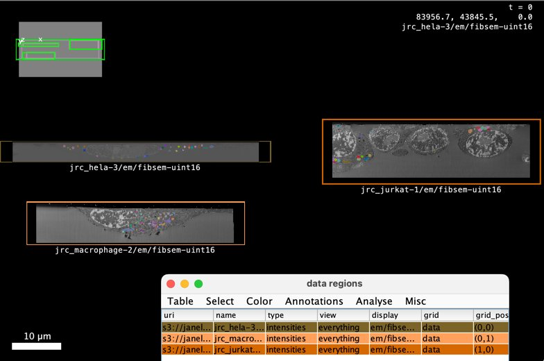

# v1 -- RFC-8: Collections and Extensibility

```{toctree}
:hidden:
:maxdepth: 1
comments/index
versions/index
```

Extending OME-Zarr with new metadata types, references, and collections

## Status

This proposal is early. Status: D1

| Name      | GitHub Handle | Institution | Date       | Status                                |
| --------- | ------------- | ----------- | ---------- | ------------------------------------- |
| Norman Rzepka | [normanrz](https://github.com/normanrz) | scalable minds | 2024-11-20 | Author |
| Eric Perlman | [perlman](https://github.com/perlman) | Yikes LLC | 2024-11-20 | Author |
| Joel Lüthi | [jluethi](https://github.com/jluethi) | BioVisionCenter Zurich | 2024-11-20 | Author |
| Lorenzo Cerrone | [lorenzocerrone](https://github.com/lorenzocerrone) | BioVisionCenter Zurich | 2024-11-20 | Author |
| Johannes Soltwedel | [jo-mueller](https://github.com/jo-mueller) | German BioImaging e.V. | 2025-10-28 | Author |
| Christian Tischer | [tischi](https://github.com/tischi) | EMBL | 2025-02-01 | Author |
| Matthew Hartley | [matthewh-ebi](https://github.com/matthewh-ebi) |  EMBL-EBI | 2025-05-05 | Author |

<!-- 
| Author    | N/A           | N/A         | xxxx-xx-xx | Author; Implemented (link to release) |
| Commenter | N/A           | N/A         | xxxx-xx-xx | Endorse (link to comment)             |
| Commenter | N/A           | N/A         | xxxx-xx-xx | Not yet (link to comment)             |
| Endorser  | N/A           | N/A         | xxxx-xx-xx | Endorse (no link needed)              |
| Endorser  | N/A           | N/A         | xxxx-xx-xx | Implementing (link to branch/PR)      |
| Reviewer  | N/A           | N/A         | xxxx-xx-xx | Endorse (link to comment)             |
| Reviewer  | N/A           | N/A         | xxxx-xx-xx | Requested by editor                   |-->

## Overview

<!--
The RFC begins with a brief overview. This section should be one or two
paragraphs that just explains what the goal of this RFC is going to be, but
without diving too deeply into the "why", "why now", "how", etc. Ensure anyone
opening the document will form a clear understanding of the RFCs intent from
reading this paragraph(s).

-->

This proposal introduces a general extensibility mechanism for OME-Zarr
metadata. It defines a common Node interface, a system for referencing nodes
locally and remotely, and a naming scheme that allows OME-Zarr to be extended
with new node types and metadata while maintaining interoperability.

The mechanism also provides a general way to represent collections: groups of
images and other data objects that can be nested, referenced, and enriched with
additional metadata. Existing concepts such as multiscales, labels, HCS
layouts, and coordinate transformations can be represented within this
framework, while future extensions can introduce additional data types and use
cases.

This proposal does not aim to define all possible extensions or metadata types.
Instead, it establishes the building blocks and extension points through which
OME-Zarr can evolve in a controlled and interoperable manner.

## Background

Scientific imaging increasingly involves collections of related data rather
than isolated images. A single experiment may produce multiple images of the
same sample, images acquired with different modalities or from different views,
derived images such as segmentations and prediction maps, and additional data
such as tables or meshes. These data may have relationships that are important
for interpreting them: they may share a coordinate space, originate from the
same acquisition, represent different stages of a processing workflow, or
need to be visualized together.

OME-Zarr already provides mechanisms for several of these use cases. For
example, labels can be associated with images, high-content screening data can
be organized into plates and wells, and RFC-5 provides coordinate systems and
transformations for relating images in a common coordinate space. The
bioformats2raw.layout metadata provides another way of organizing series of
images. However, these mechanisms have developed around individual use cases
and consequently provide different structures and conventions for representing
related data.

At the same time, applications have developed their own metadata formats for
grouping images and describing their relationships. Viewers such as Webknossos,
Neuroglancer, MoBIE and OMERO.figure can display multiple images together and
have developed JSON-based metadata to describe those collections, including
path references, coordinate transformations and rendering settings. Workflow
systems may need to associate input images with derived outputs without
modifying the original data. Archives need to describe collections of images
during both deposition and subsequent access. Similar needs arise for gallery
and grid views, correlative imaging, and images published at remote locations.

This fragmentation makes it difficult to exchange collections of scientific
data between tools. Users may need to maintain tool-specific metadata for the
same underlying relationships, while archives and other data providers may need
to produce multiple representations of the same collection for different
consumers. A general mechanism for describing related objects would allow these
use cases to be represented consistently while leaving application-specific
metadata to the applications that need it.

Extensibility is important because the range of scientific data and workflows
cannot be anticipated in a single specification. In addition to images and
segmentations, workflows may produce prediction maps, tables, meshes and other
derived data. Similarly, different applications may need to attach metadata
describing rendering state, processing context, or other relationships between
objects. Rather than defining a separate top-level mechanism for every new use
case, OME-Zarr should provide well-defined extension points through which new
node types and metadata can be introduced while maintaining interoperability.

Several existing standards could potentially be used to represent such
collections. For example, Research Object Crate (RO-Crate) provides a general
mechanism for describing collections of research artifacts and their
relationships, while JSON-LD provides standardized mechanisms for types,
identifiers and extensibility. These approaches provide useful capabilities,
but they also introduce requirements and complexity that are not well matched
to the requirements of OME-Zarr. In particular, path-based references to Zarr
and JSON metadata, including relative paths and different path types, are
central to this proposal. A purpose-built mechanism can retain the
human-readable and storage-oriented characteristics of OME-Zarr while providing
the extensibility needed by its users.

The goal of this proposal is therefore not simply to introduce another
collection format. It is to provide a common and extensible foundation for
representing OME-Zarr objects and their relationships. Collections are an
important application of this foundation: they allow images and other objects
to be grouped, nested, referenced locally or remotely, and enriched with
additional metadata. The same mechanism can also provide a path for
incorporating existing OME-Zarr structures and future data types into a more
consistent framework.

## Proposal

The following sections describe the proposed metadata framework in detail. They
define the building blocks, the abstract structure, and the core classes in
order. Each section includes schemas and small illustrative examples intended
to explain the structure and relationships between the different components.

The examples in these sections are deliberately minimal and focus on
illustrating individual aspects of the proposal, e.g.:


```jsonc
{
    "ome": {
        "version": "0.x",
        "type": "multiscale",
        "name": "our_first_example",
        "nodes": [
          {
            "id": "s0",
            "name": "s0",
            "type": "singlescale",
            "path": {
              "type": "zarr",
              "path": "./s0"
            },
          }
        ]
    }
}
```

More complete examples showing how these components can be combined to support
the use cases described in the Background are provided later in the document.


### Building blocks

The building blocks define how objects are represented using paths and references.

(rfcs:rfc8:v1:path-interface)=
#### `Path` interface

This new interface replaces the paths defined in the previous versions of the
OME-Zarr specification.

(rfcs:rfc8:v1:path-interface-example)=
##### Example

From our first example, this is the lowest level type
used to build up the definition of an image.

```jsonc
    "path": {
        "type": "zarr",
        "path": "./s0"
    }
```

(rfcs:rfc8:v1:path-interface-schema)=
##### Schema

| Field | Type | Required? | Notes |
| - | - | - | - |
| `"type"` | string | yes | Value MUST be a valid path type. |
| `"path"` | string | yes | Value MUST be a string containing a path. See below. |

(rfcs:rfc8:v1:path-interface-field-type)=
##### Field: `type`

The `type` field of a `Path` object defines how the path is interpreted. This RFC defines two unprefixed path types: `zarr` and `json`:

- The `"zarr"` type is used for paths that reference nodes in a Zarr array or
  group. Implementations MUST append `zarr.json` to the path to access the
  metadata of the referenced node.
- The `"json"` type is used for paths that reference nodes in a JSON file.

The `type` field of a `Path` object is an extension point. For detail on how to extend the `type` field with new values, see [Extensions](#extensions).

(rfcs:rfc8:v1:path-interface-field-path)=
##### Field: `path`

The `path` string can be one of the following types:

- **Relative paths.**
  To reference nodes that are on the same file system namespace as the json file describing the collection, relative paths may be used.
  Relative paths are interpreted relative to the json file describing the collection.
  Relative paths follow the relative path notation defined in [IETF RFC1808](https://datatracker.ietf.org/doc/html/rfc1808).
  Briefly, `.` and `..` are used to navigate the hierarchy and the hierarchy is separated by `/`.
  Relative paths may be used for data stored on traditional file systems as well as other storage protocols, such as HTTP or S3.
  Examples:
  - `./image.ome.zarr`
  - `../image.ome.zarr`
- **Absolute file paths.**
  On traditional file systems, absolute paths may be used with the `file` scheme as specified by [IETF RFC8089](https://datatracker.ietf.org/doc/html/rfc8089).
  Please note that absolute file paths are generally not portable across operating systems or file systems.
  Examples:
  - `file:///home/user/data/image.ome.zarr`
  - `file://C:/Users/user/data/image.ome.zarr`
- **HTTP(S) URLs.** 
  To reference nodes that are stored remotely, URLs with the `http` or `https` scheme may be used.
  URLs follow the notation defined in [IETF RFC1738](https://datatracker.ietf.org/doc/html/rfc1738).
  Examples:
  - `https://example.com/image.ome.zarr`
  - `http://example.com/image.ome.zarr`

Future RFCs may propose additional path types, such as S3 URLs or chained paths (e.g. for referencing files within a zip file).
See the [Security](#security) section for guidance on access restrictions.

(rfcs:rfc8:v1:reference-interface)=
#### `Reference` interface

The `Reference` interface is a consistent system for referring to local and remote OME-Zarr metadata objects.

(rfcs:rfc8:v1:reference-interface-schema)=
##### Schema

A reference MUST be an object with the following fields:

| Field | Type | Required? | Notes |
| - | - | - | - |
| `"id"` | string | yes | Value MUST be a string that matches `[a-zA-Z0-9-_.]+`. |
| `"path"` | object | no | Value MUST be a `Path` object. |

(rfcs:rfc8:v1:reference-interface-field-path)=
##### Field: `path`

For external references, the `path` field MUST be present.

(rfcs:rfc8:v1:abstract-structure)=
### Abstract structure

The proposal introduces a common Node structure for different types of OME-Zarr
metadata objects. Nodes can represent images or collections, and can be nested
or referenced by path. Collections provide a mechanism for grouping nodes and
may have metadata attached to them, while nodes may carry additional metadata
describing their role within a collection. Nodes can be referenced locally or
remotely, without relying on a file system hierarchy. Images may be added as
nodes to multiple collections. Arbitrary user or implementation metadata may be
added to collections or nodes, which is an opportunity to add metadata that is
only valid for a node in the context of a collection (e.g. rendering settings).

(rfcs:rfc8:v1:abstract-structure-node)=
#### `Node`

This RFC defines a basic interface for an OME-Zarr metadata object, which we
name `Node`. The [Node interface](#node) is a consistent JSON structure for
several different types of OME-Zarr metadata object, where fields specific to
the node type are inside an attributes field, and the root only stores
information used for identifying and referencing the object.

(rfcs:rfc8:v1:abstract-structure-node-schema)=
##### Schema

Objects that implement `Node` have the following fields:

| Field | Type | Required? | Notes |
| - | - | - | - |
| `"type"` | string | yes | Value MUST be a string identifying the node type. |
| `"id"` | string | no | Value MUST be a string that matches `[a-zA-Z0-9-_.]+`. IDs MUST be unique within the JSON document. |
| `"name"` | string | yes | Value MUST be a non-empty string intended for human-readable display. Names MUST be unique within the enclosing collection. |
| `"attributes"` | object | no | Value MUST be a dictionary. [See attributes section](#attributes) |

(rfcs:rfc8:v1:abstract-structure-node-field-type)=

##### Field: `type`

The `type` field of a `Node` defines its structure and semantics, including any additional fields it might have.
This RFC defines three node types: `collection`, `multiscale`, and `singlescale`.

The `type` field of a `Node` is an extension point. For detail on how to extend the `type` field with new values, see [Extensions](#extensions).

(rfcs:rfc8:v1:abstract-structure-node-field-version)=
##### Field: `version`

A `Node` object may be used as the root object of the `ome` key, in which case a `version` field, as defined in previous spec versions, is also required.
Non-root `Node` objects SHOULD NOT have a `version` field and MUST NOT have a different `version` value than the root `Node`.

(rfcs:rfc8:v1:abstract-structure-attributes)=
#### Attributes

Each `Node` has an `attributes` field that can be populated with JSON metadata.
A primary use case for the `attributes` field is the specialization of collections and nodes through additional metadata.

Attribute keys that are defined as part of this RFC are:
- `coordinateSystems`
- `coordinateTransformations`
- `labels`, as well as `labelValue` and `color` in label attributes
- `plate`, `well`, `acquisition` for HCS metadata

Attribute keys within the `attributes` dictionary of nodes are an extension point. Custom extensions can add prefixed keys (e.g., `neuroglancer:shader`, `webknossos:settings`). See [Extensions](#extensions) for more details.

#### Metadata storage

##### OME-Zarr group

Node metadata may be stored in the `ome` key of the `attributes` container in a `zarr.json` file of a Zarr group.
This is particularly useful for defining the nodes that are stored within a Zarr group. However, there is no limitation to only reference nodes within the Zarr group.

```jsonc
{
  // zarr.json
    "zarr_format": 3,
    "node_type": "group",
    "attributes": {
        "ome": {
            "version": "0.x",
            // Our `collection`-typed node attributes
            // are listed here
            "type": "collection",
            "name": "zarr.json-example",
            "nodes": [...]
        }
    }
}
```

##### Standalone JSON

Node metadata may also be stored in standalone JSON files that are stored in arbitrary locations and have a file name ending in `.json`.
Here, the metadata is stored in the `ome` key of the root object.
Standalone files are useful for persisting groupings of images that may or may not be stored in the same folder hierarchy.

```jsonc
{
  // an arbitrary json
    "ome": {
        "version": "0.x",
        // Our `collection`-typed node attributes
        // are listed here
        "type": "collection",
        "name": "standalone-example",
        "nodes": [...]
    }
}
```


### New and modified core classes

Building on the core building blocks and the abstract structure, the following
sections define concrete node types for collections, single-scale images, and
multiscale images, and integrate coordinate systems and transformations from
RFC-5. Existing OME-Zarr structures such as multiscales and
bioformats2raw.layout are reworked within the Node/Collection-based framework.

(rfcs:rfc8:v1:collection-node)=
#### `Collection` node

[Collections](#collection-node) are arbitrary groups of `Node`s` which can be
specialised for different use cases. Collections can be used to group together
images, including segmentations, prediction maps and other derived images as
well as other data types ("nodes"). Collections can be nested. Collections can
have metadata attached. Within collections, nodes can also have metadata, which
complements or overrides the nodes' own metadata. Nodes within collections are
referenced by paths instead of relying on a file system hierarchy. Paths may
also be absolute and point to remote storage.

(rfcs:rfc8:v1:collection-node-schema)=
##### Schema

| Field | Type | Required? | Notes |
| - | - | - | - |
| `"type"` | string | yes | Value MUST be `"collection"`. |
| `"id"` | string | no | Value MUST be a string that matches `[a-zA-Z0-9-_.]+`. IDs MUST be unique within the JSON document. |
| `"name"` | string | yes | Value MUST be a non-empty string intended for human-readable display. Names MUST be unique within the enclosing collection. |
| `"nodes"` | array | no | Value MUST be an array of `Node` objects. |
| `"path"` | object | no | Value MUST be a `Path` object. |
| `"attributes"` | object | no | Value MUST be a dictionary. [See attributes section](#attributes). |

Either `"nodes"` or `"path"` MUST be present, but not both.

```jsonc
{
  "ome": {
      "version": "0.x",
      "type": "collection",
      "name": "proj_gallery",
      "nodes": [{
          "type": "collection",
          "name": "gallery1",
          "path": {
            "type": "json",
            "path": "../gallery.json" 
          }
      }, ...]
  }
}
```

(rfcs:rfc8:v1:singlescale-node)=
#### `Singlescale` node

A `Singlescale` node represents one resolution level of an OME-Zarr multiscale image.
This new interface replaces the dataset metadata defined in the previous versions of the OME-Zarr specification.

(rfcs:rfc8:v1:singlescale-node-schema)=
##### Schema

| Field | Type | Required? | Notes |
| - | - | - | - |
| `"type"` | string | yes | Value MUST be `"singlescale"`. |
| `"id"` | string | no | Value MUST be a string that matches `[a-zA-Z0-9-_.]+`. IDs MUST be unique within the JSON document. |
| `"name"` | string | yes | Value MUST be a non-empty string intended for human-readable display. Names MUST be unique within the enclosing collection. |
| `"path"` | object | no | Value MUST be a `Path` object. |
| `"attributes"` | object | yes | Value MUST be a dictionary. [See attributes section](#attributes). Required because it MUST contain `coordinateTransformations`.|

`Singlescale` nodes represent resolution levels within a multiscale pyramid.

(rfcs:rfc8:v1:singlescale-node-field-coordinateTransformations)=
##### Field: `coordinateTransformations`

`Singlescale` nodes MUST have a `coordinateTransformations` key in their `attributes`, which
- is an array of transformation objects, that conform to the [coordinate transformations](#coordinate-transformations) specification
- contain and only contain a single `scale` transformation, or a `sequence` of a `scale` transformation followed by a `translation` transformation.
- The `input` field of these transformations references the `id` of the  `Singlescale` node itself.
- The `output` field references the `id` of a coordinate system defined under `coordinateSystems` in a `Multiscale` node.

```jsonc
{
  "ome": {
    "version": "0.x",
    "type": "singlescale",
    "id": "s0",
    "name": "s0",
    "path": {
      "type": "zarr",
      "path": "./s0"
    },
    "attributes": {
      ...
    }
  }
}
```

(rfcs:rfc8:v1:multiscale-node)=
#### `Multiscale` node

A `Multiscale` node represents an OME-Zarr multiscale image.
This new interface replaces the multiscale metadata defined in the previous versions of the OME-Zarr specification.

(rfcs:rfc8:v1:multiscale-node-schema)=
##### Schema

| Field | Type | Required? | Notes |
| - | - | - | - |
| `"type"` | string | yes | Value MUST be `"multiscale"`. |
| `"id"` | string | no | Value MUST be a string that matches `[a-zA-Z0-9-_.]+`. IDs MUST be unique within the JSON document. |
| `"name"` | string | yes | Value MUST be a non-empty string intended for human-readable display. Names MUST be unique within the enclosing collection. |
| `"nodes"` | array | no | Value MUST be an array of `Singlescale` objects. |
| `"path"` | object | no | Value MUST be a `Path` object. |
| `"attributes"` | object | yes | Value MUST be a dictionary. [See attributes section](#attributes). Required because it MUST contain `coordinateSystems`.|

Either `"nodes"` or `"path"` MUST be present, but not both.

```jsonc
{
    "ome": {
        "version": "0.x",
        "type": "multiscale",
        "name": "imagepyramid1",
        "nodes": [
          {
            "id": "s0",
            "name": "s0",
            "type": "singlescale",
            "path": {
              "type": "zarr",
              "path": "./s0"
            },
            "attributes": {
              ...
            }
          },
          ...
        ]
    }
}
```

#### Coordinate transformations

Coordinate systems and transformations can be stored in two distinct locations:

- For single multiscale or singlescale images, they can be stored in the `ome` key of the `attributes` container in a `zarr.json` file of the multiscales zarr group.
- For collections of two or more images in a common coordinate system, RFC-5 defines a parent-level metadata format.
  In this layout, `coordinateTransformations` define relationships between different `coordinateSystems`,
  which may be associated to multiscale images:

```jsonc
{
  "coordinateTransformations": [
    {
      "type": "translation",
      "translation": [0, 0, 100],
      "input": {"id": "physical", "path": "./image_1"}, // references collection node ID
      "output": {"id": "world"} // references coordinate system ID
    }
  ]
}
```

In a change from the previous specification, coordinate systems are referenced using the [Reference mechanism](#reference-interface), i.e. via IDs, and not via names.

```jsonc
{
  "ome": {
    "version": "0.x",
    "type": "collection",
    "name": "Tiles",
    "id": "tiles",
    "attributes": {
      "scene": {
        "coordinateSystems": [
          {
            "id": "world",
            "axes": [...]
          }
        ],
        "coordinateTransformations": [
          {
            "type": "translation",
            "translation": [0, 0, 100],
            "input": {
              "path": {
                "type": "zarr",
                "path": "./tile_0.zarr"
              },
              "id": "physical"
            },  // references coordinate system "physical" defined in tile_0
            "output": {"id": "world"}  // references coordinate system "world" defined in same node
          },
          {
            "type": "translation",
            "translation": [100, 0, 0],
            "input": {
              "path": {
                "type": "zarr",
                "path": "./tile_1.zarr"
              },
              "id": "physical"
            },  // references coordinate system "physical" defined in tile_1
            "output": {"id": "world"}  // references coordinate system "world" defined in same node
          }
        ]
      }
    },
    "nodes": [
      {
        "type": "multiscale",
        "id": "tile_0",
        "name": "Tile 0",
        "path": {
          "type": "zarr",
          "path": "./tile_0.zarr"
        }
      }, 
      {
        "type": "multiscale",
        "id": "tile_1",
        "name": "Tile 1",
        "path": {
          "type": "zarr",
          "path": "./tile_1.zarr"
        }
      }
    ]
  }
}
```

The `type` field of a coordinate transformation defines its mathematical operation. RFC-5 defines several unprefixed transformation types including `identity`, `scale`, `translation`, and others. 

The `type` field of a `CoordinateTransformation` is an extension point. For detail on how to extend the `type` field with new values, see [Extensions](#extensions).

##### `Coordinate System` interface

The `Coordinate System` objects have the following fields:

| Field | Type | Required? | Notes |
| - | - | - | - |
| `"id"` | string | yes | Value MUST be a string that matches `[a-zA-Z0-9-_.]+`. ID to use when referencing the coordinate system from a transformation. IDs MUST be unique within the JSON document. |
| `"name"` | string | no | More descriptive name for the coordinate system, if needed. |
| `"axes"` | array of strings | yes | Value MUST be an array of axes, as defined in RFC-5. |

The `type` field of an `Axis` object is an extension point. For detail on how to extend the `type` field with new values, see [Extensions](#extensions).

##### `Coordinate Transformation` interface

The `Coordinate Transformation` objects have the following fields:

| Field | Type | Required? | Notes |
| - | - | - | - |
| `"type"` | string | yes | Value MUST be a valid coordinate transform type, as defined in RFC-5. |
| `"input"` | object | yes | Value MUST be a [`Reference`](#reference-interface) to the input [`Coordinate System`](#coordinate-system-interface). |
| `"output"` | object | yes | Value MUST be a [`Reference`](#reference-interface) to the output [`Coordinate System`](#coordinate-system-interface). |

Additional fields MAY be added as required by the transform type.

Depending on the context, different fields are required:

| Context | `input` | `output` |
| - | - | - |
| **scene** | {"id": "imageA", "name": "physical" } | { "id": "imageB", "name": "physical" } |
| **Multiscale > attributes > coordinateTransformations** | { "id": "scale0"} | { "id": "image", "name": "physical" } |

**Multiscale > attributes > coordinateTransformations**: In the context of multiscales transformations, the following requirements apply:
- The `input` field MUST reference a [singlescale node](#singlescale-node).
- The `id` field MUST be present.
- The `path` field MAY be omitted or null.
- The `output` fields of all transformations MUST reference the same coordinate system via the `id` field.

**Node/Multiscales > attributes > scene > coordinateTransformations**:
In the context of node-level transformations between different multiscale collections,
the following requirements apply:
- The `input` field MUST reference a coordinate system via the `id` field.
- The `output` field MUST reference a coordinate system via the `id` field.
- If the referenced coordinate system is in the same metadata document, the `path` field MAY be omitted or null.
  If the referenced coordinate system is in a different metadata document, both the `id` and `path` fields MUST be present.


##### `Scene` attribute

The `scene` attribute MUST be an object with the following fields:

| Field | Type | Required? | Notes |
| - | - | - | - |
| `"coordinateSystems"` | array | no | Values MUST be valid instances of [`Coordinate System`](#coordinate-system-interface) objects. |
| `"coordinateTransformations"` | array | yes | Values MUST be valid instances of [`Coordinate transformation`](#coordinate-transformation-interface) objects |

A `scene` metadata object can be defined in the `attributes` of a collection to enrich the collection with spatial information of the nodes within the collection.
The `scene` field allows to clearly distinguish between the spatial information pertaining to an individual multiscale image (which is stored in the `attributes` of the multiscale)
and the spatial information pertaining to the collection of images (which is stored in the `attributes` of the collection).

<!--
These "new and modified core classes" could become concrete extensions
under Damien's proposal
-->

#### Label maps and other derived images

Previous versions of the OME-Zarr specification defined a mechanism for associating label images with a single multiscale image.
This was achieved by using a `labels` Zarr group that had to be a direct child of the multiscale Zarr group with some specific metadata. 
This proposal replaces this mechanism.

To denote a multiscale image as a label map, the `labels` attribute MUST be present.
If present, the value of the `labels` attribute MUST be an object with the following fields:

| Field | Type | Required? | Notes |
| - | - | - | - |
| `"labelAttributes"` | array of objects | no | Attributes for individual labels. Each object MUST be a [`Label Attributes` object](#label-attributes-interface).
| `"source"` | array of strings | no | An array with [`Reference`s](#reference-interface) to the source multiscales. |

Because no fields are required, an empty object MAY be used.

In this proposal, the previous `colors` and `properties` fields are combined into a single `labelAttributes` field.
The `rgba` field in the `colors` objects has been renamed to `color`.

##### `Label Attributes` interface

The `labelAttributes` field is an array of objects with the following fields:

| Field | Type | Required? | Notes |
| - | - | - | - |
| `"labelValue"` | number | yes | Value MUST be the label value. |
| `"color"` | array of number | no | Value MUST be a color in array format. | 

If present, the `color` field MUST have an array with four integers between 0 and 255, inclusive. These integers represent the uint8 values of red, green, blue and alpha.

Additional keys MAY be added, [following the attribute key naming rules](#extensions).

The previous `label-value` key is now renamed to `labelValue` for consistency.


##### Example

```jsonc
{
    "ome": {
        "version": "0.x",
        "type": "collection",
        "name": "label-example",
        "attributes": { ... },
        "nodes": [{
            "id": "raw",
            "name": "raw",
            "type": "multiscale",
            "nodes": [ ... ]
        }, {
            "name": "nuclei",
            "type": "multiscale",
            "nodes": [ ... ],
            "attributes": {
                "labels": {
                    "source": [ {"id": "raw"} ],
                    "labelAttributes": [{
                        "labelValue": 1,
                        "color": [ 255, 0, 0, 255 ]
                    }, {
                        "labelValue": 2,
                        "color": [ 0, 255, 0, 255 ]
                    }]
                }
            }
        }]
    }
}
```

#### High-content screening (HCS) metadata

High-content screening data is typically organized as a grid of wells on a plate, where each well contains one or more multiscale images from one or more acquisition rounds.
This section introduces additional metadata for organizing wells on a plate.

This proposal changes the HCS references from numeric IDs and names to string-based ID references, consistent with the [References mechanism](#reference-interface) defined above.

##### `Plate` attribute

A `collection` node representing a plate MUST have a `plate` attribute with the following fields:

| Field | Type | Required? | Notes |
| - | - | - | - |
| `"acquisitions"` | array of objects | no | List of acquisitions performed on the plate. Each object MUST be [`Acquisition` objects](#acquisition-interface). |
| `"columns"` | array of objects | yes | List of columns in the plate. Each object MUST be [`Column` objects](#column-interface). |
| `"rows"` | array of objects | yes | List of rows in the plate. Each object MUST be [`Row` objects](#row-interface). |

##### `Acquisition` interface

| Field | Type | Required? | Notes |
| - | - | - | - |
| `"id"` | string | yes | Value MUST be a string that matches `[a-zA-Z0-9-_.]+`. IDs MUST be unique within the JSON document. |
| `"name"` | string | no | A human-readable name for the acquisition. |

##### `Column` interface

| Field | Type | Required? | Notes |
| - | - | - | - |
| `"id"` | string | yes | Value MUST be a string that matches `[a-zA-Z0-9-_.]+`. IDs MUST be unique within the JSON document. |
| `"name"` | string | no | A human-readable name for the column. |

##### `Row` interface

| Field | Type | Required? | Notes |
| - | - | - | - |
| `"id"` | string | yes | Value MUST be a string that matches `[a-zA-Z0-9-_.]+`. IDs MUST be unique within the JSON document. |
| `"name"` | string | no | A human-readable name for the row. |

##### `Well` attribute

A `collection` node representing a well MUST have a `well` attribute with the following fields:

| Field | Type | Required? | Notes |
| - | - | - | - |
| `"column"` | string | yes | Value MUST be a [`Reference`](#reference-interface) to one of the columns listed in the `plate` attribute on the enclosing plate-level collection. |
| `"row"` | string | yes | Value MUST be a [`Reference`](#reference-interface) to one of the rows listed in the `plate` attribute on the enclosing plate-level collection. |

##### `Acquisition` attribute

The `acquisition` attribute MUST be a [`Reference`](#reference-interface) to one of the acquisitions.
It MAY be set on individual `multiscale` nodes within a well or on a `collection` sub-node grouping all images from a single acquisition.

We suggest two possible layouts for HCS data, which are not mutually exclusive and can be used in combination: a "wide" layout where all images are direct children of the well collection and a "tall" layout where images are grouped in sub-collections by acquisition. 

##### Wide example (acquisitions flat in the well)

In this layout, all multiscale nodes are direct children of the well collection.
Each node carries an `acquisition` attribute.
Derived images such as label maps are siblings of their source image and can still be linked via the `source` reference in their `labels` attribute. This layout is more compact but can become cluttered when there are multiple acquisitions and derived nodes.

```jsonc
{
    "ome": {
        "version": "0.x",
        "type": "collection",
        "name": "hcs-plate-001",
        "attributes": {
            "plate": {
                "acquisitions": [
                    {
                        "id": "acq_0",
                        "name": "Acquisition Round 1"
                    }
                ],
                "columns": [
                    {
                        "id": "1",
                        "name": "1"
                    }
                ],
                "rows": [
                    {
                        "id": "A",
                        "name": "A"
                    }
                ]
            }
        },
        "nodes": [
            {
                "type": "collection",
                "name": "well A01",
                "attributes": {
                    "well": {
                        "column": {"id": "1"},
                        "row": {"id": "A"}
                    }
                },
                "nodes": [
                    {
                        "id": "A01_0",
                        "type": "multiscale",
                        "name": "A01_0",
                        "path": {
                            "type": "zarr",
                            "path": "./A/01/001.img"
                        },
                        "attributes": {
                            "acquisition": {"id": "acq_0"}
                        }
                    },
                    {
                        "type": "multiscale",
                        "name": "A01_0_ill_corrected",
                        "path": {
                            "type": "zarr",
                            "path": "./A/01/001_ill_corrected.img"
                        },
                        "attributes": {
                            "acquisition": {"id": "acq_0"},
                            "source": [{"id": "A01_0"}]
                        }
                    },
                    {
                        "type": "multiscale",
                        "name": "A01_0_nuclei",
                        "path": {
                            "type": "zarr",
                            "path": "./A/01/001_nuclei.img"
                        },
                        "attributes": {
                            "acquisition": {"id": "acq_0"},
                            "labels": {
                              "source": [{"id": "A01_0"}]
                            }
                        }
                    }
                ]
            }
        ]
    }
}
```

##### Tall example (acquisitions as sub-collections)

In this layout, each acquisition is wrapped in a sub-collection inside the well.
The `acquisition` attribute is set on the sub-collection rather than on individual nodes.
This serves as an example that wells can consist of collections, not just multiscales. 

```jsonc
{
    "ome": {
        "version": "0.x",
        "type": "collection",
        "name": "hcs-plate-001",
        "attributes": {
            "plate": {
                "acquisitions": [
                    {
                        "id": "acq_0",
                        "name": "Acquisition Round 1"
                    },
                    {
                        "id": "acq_1",
                        "name": "Acquisition Round 2"
                    }
                ],
                "columns": [
                    {
                        "id": "1",
                        "name": "1"
                    }
                ],
                "rows": [
                    {
                        "id": "A",
                        "name": "A"
                    }
                ]
            }
        },
        "nodes": [
            {
                "type": "collection",
                "name": "well A01",
                "attributes": {
                    "well": {
                        "column": {"id": "1"},
                        "row": {"id": "A"}
                    }
                },
                "nodes": [
                    {
                        "type": "collection",
                        "name": "A01_acq0",
                        "attributes": {
                            "acquisition": {"id": "acq_0"}
                        },
                        "nodes": [
                            {
                                "id": "A01_0",
                                "type": "multiscale",
                                "name": "A01_0",
                                "path": {
                                    "type": "zarr",
                                    "path": "./A/01/001.img"
                                }
                            },
                            {
                                "type": "multiscale",
                                "name": "A01_0_nuclei",
                                "path": {
                                    "type": "zarr",
                                    "path": "./A/01/001_nuclei.img"
                                },
                                "attributes": {
                                    "labels": {
                                        "source": ["A01_0"]
                                    }
                                }
                            }
                        ]
                    },
                    {
                        "type": "collection",
                        "name": "A01_acq1",
                        "attributes": {
                            "acquisition": {"id": "acq_1"}
                        },
                        "nodes": [
                            {
                                "id": "A01_1",
                                "type": "multiscale",
                                "name": "A01_1",
                                "path": {
                                    "type": "zarr",
                                    "path": "./A/01/002.img"
                                }
                            },
                            {
                                "type": "multiscale",
                                "name": "A01_1_nuclei",
                                "path": {
                                    "type": "zarr",
                                    "path": "./A/01/002_nuclei.img"
                                },
                                "attributes": {
                                    "labels": {
                                        "source": [{"id": "A01_1"}]
                                    }
                                }
                            }
                        ]
                    }
                ]
            }
        ]
    }
}
```

While inlined plate collections are shown above for simplicity, an on-disk plate collection could still refer to separate on-disk collections within each well that carry a `well` attribute.

#### `bioformats2raw.layout` metadata

The `bioformats2raw.layout` metadata is replaced by this proposal.
A series of images can now be represented as a collection of multiscale images.

## Extensions

This section describes how existing classes and class attributes can be extended 
in a controlled manner, enabling custom functionality while maintaining interoperability.

Extensions to the specification can be made at defined extension points, and
they are declared using a prefix naming scheme.

### Extension points

The extension system defines several points at which OME-Zarr can be extended
while maintaining a common framework. These include node types, attribute keys,
path types, coordinate transformation types, and coordinate system axis
types. Each extension point is identified and declared in the
corresponding sections of this proposal.


### Naming scheme

Extension identifiers follow a prefixed vs unprefixed convention:

- **Unprefixed identifiers** are reserved for the core specification and can only be added or modified through the RFC process.
- **Prefixed identifiers** (separated by `:`) can be freely introduced by custom extensions without requiring an RFC. The prefix identifies the user or organization that introduces and maintains the extension. Prefixes SHOULD be registered in a central registry (a Github repository under the `ome` organization). Registration of a prefix claims maintainership for that prefix and provides a discoverable location for the specification of custom extensions.
- The `ome:` prefix is reserved for official extensions that have not yet been incorporated into the core specification.

This naming scheme applies uniformly to all extension points. Implementations that do not recognize a prefixed extension point SHOULD treat the referenced value as opaque and MAY skip it or display it with a generic representation.

Custom-prefixed keys can also be used to add additional sub-keys or behavior to existing unprefixed keys.
This can be thought of as a way of achieving inheritance.
For example, the `well` key in a `Node`'s `attributes` could be specialized by a `fractal:well` key that adds additional sub-keys or alters behavior.
It is out-of-scope of this RFC to fully define the inheritance behavior.
That is left to be defined on a case-by-case basis for individual key specifications and may be standardized in a future RFC.

### Examples

#### A `Path` with an extension `type` value

```jsonc
    "path": {
        "type": "myorg:zip",
        "path": "./mylab.zip"
    }
```

#### A `coordinateTransformation` with an extension `type` value

```jsonc
"coordinateTransformations": [
  {
    "type": "translation",
    "translation": [0, 0, 100],
    ...
  },
  {
    "type": "myorg:nonlinear",
    ...
  }
]
```


## User stories

### 1. Visualize multiple images at once
Several viewers are capable of visualizing multiple images, that can map to a common coordinate space, at once. Examples are Webknossos, Neuroglancer, MoBIE and OMERO.figure. All of these tools have developed their own JSON-based metadata to combine multiple images in a collection, see "[Prior art and references](#prior-art-and-references)". In addition to mere path references of the images, this metadata also contains information about coordinate transforms and rendering settings.

As there is no standard-compliant way in OME-Zarr to describe multiple images in one entity, users need to copy multiple links to interoperably visualize multiple images.

RFC-5 introduced the `scene` metadata, which partially solved this issue.
However, with this proposal we aim to embed it in a more flexible collection mechanism.

### 2. m:n segmentations
While OME-Zarr has support for attaching labels to images, the support is not sufficient for many use cases.
There are multiple label images that can be attached to a single image. This is a 1:n relationship. However, m:n relationships would be desired because labels might be related to multiple images. Examples for that are:
- Multiple correlated images express the same feature that is being labeled.
- Channels are stored in multiple images instead of in the same image.

Additionally, there are other types of derived images, such as prediction maps, which cannot currently be represented by OME-Zarr. In comparison to label maps, where each voxel is assigned a discrete ID, prediction maps have a channel per segmentation class (or similar) and each voxel is assigned a probability or other continuous value.

### 3. Shallow copies of images with segmentations
Many workflow engines operate by taking input images and producing output images. In many cases, it is desired to keep the input images unchanged.
Let's assume the example of a pixel classification task. This task would take an OME-Zarr image as input and produce a prediction map. To express the relationship between input image and output prediction, the task could create a collection that contains the prediction and links to the image (i.e. shallow copy). The output collection could then be used to visualize both at the same time. This is applicable to a wide variety of workflow tasks with the result that the outputs of each task can be visualized or further processed independent of other tasks.

```
├─ input_image.zarr
│  ├─ zarr.json # OME-Zarr multiscale
│  ├─ 0 
│  └─ ... 
└─ output_collection.zarr
   │  # includes collection metadata and link to "../input_image.zarr"
   ├─ zarr.json 
   └─ prediction.zarr
      ├─ zarr.json # OME-Zarr multiscale
      ├─ 0 
      └─ ...
```

Examples for such workflow systems:
- [Voxelytics](https://voxelytics.com)
- [Fractal](https://fractal-analytics-platform.github.io/)
- [Nextflow](https://www.nextflow.io/)

### 4. Correlative imaging

Several applications in microscopy and other imaging domains involve the acquisition of images
of the same object from different angles or with different imaging modalities.
Examples of such applications are (among others) the following:
- Correlative light and electron microscopy (CLEM): In this case,
  a sample is examined with both electron and light microscopy,
  both of which feature their own sets of spatial dimensions.
  A set of coordinate transformations is used to map between the different images.
- Multiview lightsheet: For this application,
  lightsheet microscopes acquire multiple views of the same object from different angles.
  A set of coordinate transformations is used to map between the different views.
- Multimodal medical imaging: Different imaging modalities (e.g., CT, MRI, PET, etc),
  are often used either in conjunction or at different timepoints to observe the same object or anatomical structure. 

Such applications require the storage of collections of images and their mutual relationships,
the metadata for which has already been defined by RFC-5 (Coordinate Transformations in OME-NGFF).
In the context of RFC-5, images are part of a collection if they share a common coordinate space
that is defined by coordinate systems and coordinate transformations.
Since the relationships between images are already defined
in a graph-like schema as proposed in this RFC,
the transformations metadata can be represented as a specialized collection
with coordinate systems and transformations as attributes of the collection and nodes.
In a way, coordinate transformations and systems simply become a subset of the more general collection concept.


### 5. High Content Screening (HCS) plates

OME-Zarr high content screening plates are a current example of a narrowly defined type of collection.
They allow grouping OME-Zarr images in multiple hierarchy levels: A plate contains wells, which are organized as row folders with column subfolders in each.
Each well folder can contain a number of images.
There is defined metadata about which wells are in a plate and about which images are in a well at the different hierarchy levels, typically with some additional optional metadata like the acquisitions that exist in a plate and which image belongs to which acquisition.

This hierarchy is very useful for typical experiments where researchers imaged a multi-well plate.
Multiple viewers like MoBIE, napari & ViZarr support displaying the different wells arranged in the plate format given the OME-Zarr HCS metadata, thus avoiding the need for tool-specific metadata and showing the benefits of such collection concepts.

The current HCS spec also has its limitations: It has a strict definition of potential metadata fields at the plate and well level.
There are multiple areas where it would be interesting to extend this spec.
There are [ongoing discussions](https://github.com/ome/ngff/pull/137) about whether individual microscope fields of view (ie. well) should be stored as individual OME-Zarr images or as a single OME-Zarr image and how one would represent [different processing intermediates in a plate](https://forum.image.sc/t/how-to-build-hcs-zarrs-with-multiple-image-types-per-fov/119329).
In these contexts, the current HCS spec lacks flexibility to get additional metadata about how images in a well are related and what a viewer should do with them.
For example, depending on whether an OME-Zarr image in a well is an individual field of view of a given acquisition, a second acquisition of the same region in a plate or an image derived from a given processing operation, the optimal viewer default on whether to show or not show multiple images at once will vary.
A flexible metadata field like `attributes` would allow us to better define such image metadata.
A more flexible HCS collection system could also allow to provide advanced metadata on well positions [when wells have different sizes](https://github.com/ome/ome-zarr-py/issues/240) or address other edge-cases in the current HCS configuration.


### 6. Image Archive
Data archives that support deposition and access to OME-Zarr formatted images have two primary use cases for collections of images.
For the first, users submitting data to deposition databases need ways to aggregate collections of images in their data upload structure, and do so in a way that supports describing how those images relate (e.g. parts of the same acquisition series, plate/well data as mentioned above).
This can then be parsed during data submission, and used to create appropriate database records.

Secondly, when providing outgoing access to data, archives want to provide groupings of images that allow compatibility with data exploration and visualisation tools. Given the increasingly rich ecosystem of these tools (mentioned across these use cases, and including grid views, segmentations, multiple images and plate/well data) standardisation is necessary to avoid the need to produce view/exploration schema for each tool.

### 7. Rendering settings
Viewers, such as Webknossos, Neuroglancer, MoBIE and OMERO.figure, are capable of visualizing multiple OME-Zarr images ("layers") in a view.
To share such a view, metadata serialization is required that contains not only links to the images, but also attached metadata of the rendering state.
The rendering state of a collection might contain locations, rotation angles, coordinate systems as well as rendering state of individual layers.
The rendering state of layers might contain pixel transformations (e.g. min/max scaling, colors, shaders), coordinate transformation overrides, visibility settings.

Some of these rendering state attributes might be compatible across implementations, but others might not.
This proposal does not intend to provide a specification for the rendering state itself, but provide metadata containers to store such viewer-specific state.


### 8. Grouping together remote images

When building upon images that have been published by others, it might be useful to create virtual groupings of multiple remotely stored images.
For example, a lab might create automatic segmentations of a large image that has been published by another lab.
While the segmentation would now be published on its own, it could still be published with a link to the original images so that viewers are able to show the segmentation as an overlay on the original data.

### 9. Adding other datatypes to images
When processing images in the OME-Zarr format, a diversity of derived data like segmentation, probability maps, meshes, tables and other formats can be generated.
This proposal does not intend to provide a specification to all these datatypes, but to define the metadata of how related data in Zarr or other formats can be linked to OME-Zarr images.

Because there is already a specification for labels in the spec, the label definition is broadened by this spec.
For other datatypes like tables, [past proposals](https://github.com/ome/ngff/pull/64) have focused on how tables can be serialised to OME-Zarr.
As these proposals did not proceed to become part of the OME-Zarr spec, different implementers have built their own sub-specs for tables (see e.g. the [ngio table definition](https://fractal-analytics-platform.github.io/ngio/v0.3.2/table_specs/overview/) coming from the Fractal project or the [label table](https://mobie.github.io/specs/mobie_spec.html#table-data) in MoBIE).
While future proposals and extensions may define datatypes like tables more strictly, this proposal offers a general way to make such additional data types discoverable.

### 10. Gallery / grid views

It is useful to visualise similar images in a grid view where all images are visible as "thumbnails", which in the case of OME-Zarr can simply be the lowest resolution version of the data. Like this, users can have an overview of all the data and can then decide to "zoom in" on some datasets to explore them in higher resolution.

Implementations of this concept include:
- [Zarrcade](https://github.com/JaneliaSciComp/zarrcade)
- [BioFile Finder](https://bff.allencell.org/)
- [MoBIE grid views](https://mobie.github.io/tutorials/image_grids_and_tables.html)
- [OME2024 NGFF challenge](https://ome.github.io/ome2024-ngff-challenge/)

For example, [this table](https://docs.google.com/spreadsheets/d/1t5xB0p0zd2-a6ynV-JAuLJqs-mg-pFFikhfmQGZwRpI/edit?usp=sharing) defines a MoBIE grid view of three OpenOrganelle vEM images along with label images of mitochondria segmentation. It can be opened in MoBIE via the "Open Simple Collection Table" menu entry: 



#### Example: A grid view gallery

A gallery view could also be represented within the proposed collection JSON as shown in the below example.

Note that the grid view is modelled here as a collection of collections, where the collection at each grid position includes the raw EM image and the mitochondria segmentation label mask image.

Also note some MoBIE specific attributes:

- `"mobie:grid": "true"` specifies that the data should be laid out in a grid.

```jsonc
{
    "ome": {
        "version": "0.x",
        "type": "collection",
        "name": "openorganelle-mito-gallery",
        "attributes": {
            "mobie:grid": "true"
        },
        "nodes": [
            {
                "name": "jrc_hela-3",
                "type": "collection",
                "nodes": [
                    {
                        "name": "fibsem-uint16",
                        "type": "multiscale",
                        "path": {
                          "type": "zarr",
                          "path": "https://janelia-cosem-datasets.s3.amazonaws.com/jrc_hela-3/jrc_hela-3.zarr/em/fibsem-uint16",
                        }
                    },
                    {
                        "name": "mito_seg",
                        "type": "multiscale",
                        "path": {
                          "type": "zarr",
                          "path": "https://janelia-cosem-datasets.s3.amazonaws.com/jrc_hela-3/jrc_hela-3.zarr/labels/mito_seg",
                        },
                        "attributes": {
                            "labels": {}
                        }
                    }
                ]
            },
            {
                "name": "jrc_macrophage-2",
                "type": "collection",
                "nodes": [
                    {
                        "name": "fibsem-uint16",
                        "type": "multiscale",
                        "path": {
                          "type": "zarr",
                          "path": "https://janelia-cosem-datasets.s3.amazonaws.com/jrc_macrophage-2/jrc_macrophage-2.zarr/em/fibsem-uint16"
                        }
                    },
                    {
                        "name": "mito_seg",
                        "type": "multiscale",
                        "path": {
                          "type": "zarr",
                          "path": "https://janelia-cosem-datasets.s3.amazonaws.com/jrc_macrophage-2/jrc_macrophage-2.zarr/labels/mito_seg"
                        },
                        "attributes": {
                            "labels": {}
                        }
                    }
                ]
            },
            {
                "name": "jrc_jurkat-1",
                "type": "collection",
                "nodes": [
                    {
                        "name": "fibsem-uint16",
                        "type": "multiscale",
                        "path": {
                          "type": "zarr",
                          "path": "https://janelia-cosem-datasets.s3.amazonaws.com/jrc_jurkat-1/jrc_jurkat-1.zarr/em/fibsem-uint16"
                        }
                    },
                    {
                        "name": "mito_seg",
                        "type": "multiscale",
                        "path": {
                          "type": "zarr",
                          "path": "https://janelia-cosem-datasets.s3.amazonaws.com/jrc_jurkat-1/jrc_jurkat-1.zarr/labels/mito_seg"
                        },
                        "attributes": {
                            "labels": {}
                        }
                    }
                ]
            }
        ]
    }
}
```


## Other Examples

The examples below demonstrate combinations of various features in this
proposal. Further example can be found under
https://github.com/normanrz/ngff-rfc8-collection-examples/.

### A multiscale group with a single, inlined resolution level
```jsonc
{
    "ome": {
        "version": "0.x",
        "type": "multiscale",
        "name": "multiscales_example",
        "id": "image_0",
        "nodes": [
          {
            "id": "s0",
            "name": "s0",
            "type": "singlescale",
            "path": {
              "type": "zarr",
              "path": "./s0"
            },
            "attributes": {
              "coordinateTransformations": [
                {
                  "type": "scale",
                  "scale": [1, 1, 1],
                  "input": {"id": "s0"},
                  "output": {"id": "physical"}
                }
              ]
            }
          }
        ],
        "attributes": {
          "coordinateSystems": [
            {
              "id": "physical",
              "axes": [...]
            }
          ]
        }
    }
}
```

### A multiscale group with a single resolution level

The multiscale group contains the following metadata:
```jsonc
{
    "ome": {
        "version": "0.x",
        "type": "multiscale",
        "name": "multiscales_example",
        "id": "image_0",
        "nodes": [
          {
            "id": "s0",
            "name": "s0",
            "type": "singlescale",
            "path": {
              "type": "zarr",
              "path": "./s0"
            },
          }
        ],
        "attributes": {
          "coordinateSystems": [
            {
              "id": "physical",
              "name": "The physical coordinate system",
              "axes": [...]
            }
          ]
        }
    }
}
```

And the `zarr.json` at the location of the resolution level (`./s0/zarr.json`) contains the following metadata:
```jsonc
{
    "ome": {
        "version": "0.x",
        "type": "singlescale",
        "name": "s0",
        "id": "s0",
        "attributes": {
          "coordinateTransformations": [
            {
              "type": "scale",
              "scale": [1, 1, 1],
              "input": {"id": "s0"},
              "output": {
                "id": "physical",
                "path": {
                  "type": "json",
                  "path": "../zarr.json"
                }
              }
            }
          ]
        }
    }
}
```

### A collection with a multiscale and a nested collection
```jsonc
{
    "ome": {
        "version": "0.x",
        "type": "collection",
        "name": "jrc_hela-1",
        "nodes": [
          {
            "name": "raw",
            "type": "multiscale",
            "path": {
              "type": "zarr",
              "path": "./raw", // a relative or absolute path
            },
            "attributes": {    
                "example-viewer:settings": {
                    "isDisabled": true
                },
                ... // arbitrary user-defined metadata
            },
          },
          {
              "name": "nested_collection",
              "type": "collection",
              "path": {
                "type": "json",
                "path": "./nested_collection.json"
              }
          }, ... 
        ],
        "attributes": {
            ...
        }
    }
}
```


### A collection with an inlined multiscale
```jsonc
{
    "ome": {
        "version": "0.x",
        "type": "collection",
        "name": "example",
        "nodes": [
          {
            "name": "raw",
            "id": "raw",
            "type": "multiscale",
            "nodes": [
              {
                "id": "raw_0",
                "name": "raw_0",
                "type": "singlescale",
                "path": {
                  "type": "zarr",
                  "path": "./raw/0"
                }
              }
            ],
            "attributes": {
              "coordinateTransformations": [
                {
                  "type": "scale",
                  "scale": [1, 1, 1],
                  "input": {"id": "raw_0"},
                  "output": {"id": "physical"}
                }
              ],
              "coordinateSystems": [
                {
                  "id": "physical",
                  "axes": [...]
                }
              ]
            }
          }
        ]
    }
}
```

## Requirements

The key words "MUST", "MUST NOT", "REQUIRED", "SHALL", "SHALL NOT", "SHOULD", "SHOULD NOT", "RECOMMENDED", "MAY", and "OPTIONAL" in this document are to be interpreted as described in [IETF RFC 2119](https://tools.ietf.org/html/rfc2119)

<!--
For the problem(s) solved by this RFC, what constrains the possible solutions?
List other RFCs, or standards (ISO, etc.) which are applicable. 
-->


## Stakeholders

<!--
Who has a stake in whether this RFC is accepted?

* Facilitator: The person appointed to shepherd this RFC through the RFC
  process.
* Reviewers: List people whose vote (+1 or -1) will be taken into consideration
  by the editor when deciding whether this RFC is accepted or rejected. Where
  applicable, also list the area they are expected to focus on. In some cases
  this section may be initially left blank and stakeholder discovery completed
  after an initial round of socialization. Care should be taken to keep the
  number of reviewers manageable, although the exact number will depend on the
  scope of the RFC in question.
* Consulted: List people who should review the RFC, but whose approval is not
  required.
* Socialization: This section may be used to describe how the design was
  socialized before advancing to the "Iterate" stage of the RFC process. For
  example: "This RFC was discussed at a working group meetings from 20xx-20yy"
-->

- Visualization developers
- Data management developers
- Image Archives
- Workflow developers

### Socialization
* [Github issue](https://github.com/ome/ngff/issues/31)
* OME-NGFF community meeting April 2024
    * https://docs.google.com/presentation/d/1ANsNdCchmwWR1grhg5-hSrWH5nyPz2QSFYToF56PVc4/edit#slide=id.g2c639a0285f_0_40
* OME meeting 2024 in Dundee
* I2K 2024 in Milan
* OME-NGFF hackathon Zurich 2024
    * https://hackmd.io/OeY6A-ysQQu_NZuG7a-cXQ
* Volume EM GRC Barcelona 2025
* OME-NGFF community meeting June 2025
* OME-NGFF hackathon Zurich 2025
* OME meeting 2026 in Düsseldorf

## Implementation

This RFC has not been implemented yet.

However, several visualization tools already have support for showing multiple images in the same view, see "Prior art and references".
Adopting this new metadata format is achievable with reasonable effort.

It is also expected that programming libraries will support this new metadata format to construct and inspect collections.

<!--
Many RFCs have an "implementation" section which details how the implementation
will work. This section should explain the rough specification changes. The
goal is to give an idea to reviewers about the subsystems that require change
and the surface area of those changes. 

This knowledge can result in recommendations for alternate approaches that
perhaps are idiomatic to the project or result in less packages touched. Or, it
may result in the realization that the proposed solution in this RFC is too
complex given the problem.

For the RFC author, typing out the implementation in a high-level often serves
as "[rubber duck debugging](https://en.wikipedia.org/wiki/Rubber_duck_debugging)" and you can catch a lot of
issues or unknown unknowns prior to writing any real code.
-->


## Drawbacks, risks, alternatives, and unknowns
This RFC adds breaking changes that are neither backwards nor forwards compatible, which presents additional complexity to implementations and users.

Defining a custom format instead of reusing existing validated formats introduces risk of design errors.

### Redundant metadata

This RFC introduces the possibility for redundant metadata.
For example, a collection can contain inlined metadata for multiscale images and the multiscale images can also be specified in standalone metadata.
This redundant metadata can go out of sync.
It is the responsibility of implementations to ensure consistency where required.

For reading, implementations SHOULD parse the metadata as available to the implementation from the user-supplied entry point in the OME-Zarr hierarchy. 


### New Multiscale/Singlescale metadata

In an effort to unify the existing and new collection types of OME-Zarr, the Multiscale metadata has been changed to mirror the Collection metadata.
Still, it is a specialized node type because of its prevalence and semantic requirements with regards to its Singlescale children nodes.
The Singlescale metadata has been elevated to a first-class node type.
This also allows specifying images that only contain a single resolution level.

These changes are breaking changes to the core of the OME-Zarr specification.

<!--
* What are the costs of implementing this proposal?
* What known risks exist? What factors may complicate your project? Include:
  security, complexity, compatibility, latency, service immaturity, lack of
  team expertise, etc.
* What other strategies might solve the same problem?
* What questions still need to be resolved, or details iterated upon, to accept
  this proposal? Your answer to this is likely to evolve as the proposal
  evolves.
* What parts of the design do you expect to resolve through the RFC process
  before this gets merged?
* What parts of the design do you expect to resolve through the implementation
  of this feature before stabilization?
* What related issues do you consider out of scope for this RFC that could be
  addressed in the future independently of the solution that comes out of this
  RFC?
-->

## Abandoned Ideas

### RO Crate
Instead of defining a custom collection format for OME-Zarr, existing collection formats, such as RO Crate, could be utilized.

Research Object Crate ("RO Crate") is a standard format that utilizes JSON-LD to define collections of research artifacts as well as their relationships and other metadata.
Utilizing RO Crate for OME-Zarr collections would allow building upon an existing standard that has been validated in the field.
Additionally, it would allow to easily integrate with other research artifacts, such as publications, talks, protocols, etc.

RO Crate imposes very strict requirements around its metadata.
Every key in a metadata object needs to be backed by a well-defined schema.
While very precise, this presents burdens for adding user-defined metadata.

All the metadata in RO Crate is normalized and hierarchies or relationships are maintained via IDs.
This is a common approach in database systems design.
However, it leads to metadata files which are very hard to read by humans.
This practically necessitates the use of libraries to inspect the metadata, which contradicts a design guideline of Zarr and OME-Zarr.

This RFC proposes adopting a simpler collection specification for OME-Zarr.
RO Crate can still be used alongside collections or images to define metadata and integrate with other research objects.

### JSONLD

The RFC explored the possibility of using JSON-LD as the basis for the collection metadata format.
JSON-LD is a W3C standard for linked data that extends JSON with a `@context` mechanism for defining vocabularies, making JSON documents interoperable with semantic web tools.

#### Benefits

JSON-LD is a widely used and well-supported standard with broad tooling support.
It provides a standardized type system via `@type`, which maps types to IRIs for global uniqueness and is backed by standard validation tooling.
It has built-in support for defining and referencing objects via `@id`, with JSON-LD processors understanding which properties are references versus literals.
Extensibility is handled through contexts: custom vocabularies can be published at URLs and reused across documents, which would eliminate the need for a custom prefix registry.
Namespace management via prefixes (e.g., `mobie:grid`) clearly distinguishes custom terms from core terms and prevents naming collisions between organizations extending the format.

The planned approach would have replaced the `type` and `id` fields with `@type` and `@id`, and added a `@context` field inside the `ome` object referencing a versioned context URL (e.g., `https://ngff.openmicroscopy.org/0.x/context.jsonld`).
Custom extensions would define their namespace in the context array, removing the need for a central prefix registry.
Internal references (e.g., for `input`, `output`, `source`) would use proper JSON-LD semantics via context definitions, allowing string values to be interpreted as references to `@id` values.

#### Downsides

The core problem with JSON-LD for this RFC is that it is based on IRIs, which makes path-based references difficult.
Standard JSON-LD linking does not support relative paths (e.g., `./image.zarr`) or file system paths.
It also does not support the typed path mechanism—distinguishing between `zarr` and `json` path types—that is a central part of this RFC.
This would force a hybrid approach where the `Path` interface uses JSON-LD syntax (`@type`) but does not conform to JSON-LD semantics.

Such a hybrid approach introduces its own complexity.
Users familiar with JSON-LD would expect standard linking to work, but our custom `Path` mechanism is not standard JSON-LD.
Generic JSON-LD processors would not understand the custom path mechanism and would not be able to fully process the metadata.
The benefit of reusing existing JSON-LD tooling would thus be largely negated.

To keep complexity manageable, we would need to heavily restrict which parts of JSON-LD are allowed.
This creates a lose-lose situation: JSON-LD experts may be confused by the deviations from standard JSON-LD, while users unfamiliar with JSON-LD would still need to learn both JSON-LD concepts and the OME-NGFF-specific extensions.
The learning curve would be higher than with a purpose-built format, without corresponding benefits in return.

For these reasons, the RFC adopts a simpler custom format with a prefix-based naming scheme instead of JSON-LD.


<!--
As RFCs evolve, it is common that there are ideas that are abandoned. Rather
than simply deleting them from the document, you should try to organize them
into sections that make it clear they're abandoned while explaining why they
were abandoned.

When sharing your RFC with others or having someone look back on your RFC in
the future, it is common to walk the same path and fall into the same pitfalls
that we've since matured from. Abandoned ideas are a way to recognize that path
and explain the pitfalls and why they were abandoned.

-->

## Prior art and references

### Initial Github issue

Initial discussions started here: https://github.com/ome/ngff/issues/31

### Neuroglancer JSON

See https://neuroglancer-docs.web.app/json/api/index.html

<details>
<summary>JSON example</summary>
Shortened version from https://fafb-ffn1.storage.googleapis.com/landing.html
<pre>
{
  "dimensions": {
    "x": [
      4e-9,
      "m"
    ],
    "y": [
      4e-9,
      "m"
    ],
    "z": [
      4e-8,
      "m"
    ]
  },
  "position": [
    109421.8984375,
    41044.6796875,
    5417
  ],
  "crossSectionScale": 2.1875,
  "projectionOrientation": [
    -0.08939177542924881,
    -0.9848012924194336,
    -0.07470247149467468,
    0.12882165610790253
  ],
  "projectionScale": 27773.019357116023,
  "layers": [
    {
      "type": "image",
      "source": {
        "url": "precomputed://gs://neuroglancer-fafb-data/fafb_v14/fafb_v14_orig"
      },
      "blend": "default",
      "name": "fafb_v14",
      "visible": false
    },
    {
      "type": "image",
      "source": {
        "url": "precomputed://gs://neuroglancer-fafb-data/fafb_v14/fafb_v14_clahe"
      },
      "blend": "default",
      "name": "fafb_v14_clahe"
    },
    {
      "type": "segmentation",
      "source": {
        "url": "precomputed://gs://fafb-ffn1-20190805/segmentation"
      },
      "segments": [
        "710435991"
      ],
      "skeletonRendering": {
        "mode2d": "lines_and_points",
        "mode3d": "lines"
      },
      "name": "fafb-ffn1-20190805"
    },
    ...
  ],
  "showAxisLines": false,
  "showSlices": false,
  "layout": "xy-3d"
}
</pre>
</details>


### MoBIE collections

The MoBIE collection table allows users to specify a collection of images and segmentations (label mask images) and configure their rendering.

Each row in the table corresponds to one (single-channel) image or segmentation. 

To open multi-channel images the image URI must be added several times and a `channel` column must be added to specify which channel to load. 

One can specify an affine transformation for each image.

One can configure a grid layout to render multiple images side-by-side.

The same image can be opened multiple times, with different rendering settings or different transformations.

- [Example table](https://github.com/mobie/mobie-viewer-fiji/blob/main/src/test/resources/collections/blobs-grid-table.txt)
- [More example tables](https://github.com/mobie/mobie-viewer-fiji/blob/main/src/test/resources/collections)
- [More details](https://mobie.github.io/tutorials/mobie_collection_table.html)


### Webknossos datasource-properties.json
Webknossos uses a JSON format to define "datasets", which is a non-nestable collection of images with some metadata attached. It mirrors some of the OME-Zarr multiscale metadata for compatibility reasons.

<details>
<summary>JSON example</summary>
<pre>
{
  "id": {
    "name": "l4_sample3",
    "team": ""
  },
  "dataLayers": [
    {
      "name": "color",
      "category": "color",
      "boundingBox": {
        "topLeft": [
          3072,
          3072,
          512
        ],
        "width": 1024,
        "height": 1024,
        "depth": 1024
      },
      "elementClass": "uint8",
      "mags": [
        {
          "mag": [
            1,
            1,
            1
          ],
          "path": "./color/1",
          "axisOrder": {
            "x": 1,
            "y": 2,
            "z": 3,
            "c": 0
          },
          "channelIndex": 0
        },
        {
          "mag": [
            2,
            2,
            1
          ],
          "path": "./color/2-2-1",
          "axisOrder": {
            "x": 1,
            "y": 2,
            "z": 3,
            "c": 0
          },
          "channelIndex": 0
        }
      ],
      "numChannels": 1,
      "dataFormat": "zarr"
    },
    {
      "name": "segmentation",
      "boundingBox": {
        "topLeft": [
          3072,
          3072,
          512
        ],
        "width": 1024,
        "height": 1024,
        "depth": 1024
      },
      "elementClass": "uint32",
      "mags": [
        {
          "mag": [
            1,
            1,
            1
          ],
          "path": "./segmentation/1",
          "axisOrder": {
            "x": 1,
            "y": 2,
            "z": 3,
            "c": 0
          },
          "channelIndex": 0
        },
        {
          "mag": [
            2,
            2,
            1
          ],
          "path": "./segmentation/2-2-1",
          "axisOrder": {
            "x": 1,
            "y": 2,
            "z": 3,
            "c": 0
          },
          "channelIndex": 0
        }
      ],
      "largestSegmentId": 2504697,
      "numChannels": 1,
      "dataFormat": "zarr",
      "category": "segmentation"
    }
  ],
  "scale": {
    "factor": [
      11.24,
      11.24,
      28
    ],
    "unit": "nanometer"
  }
}
</pre>
</details>

### STAC
from the Geo Community https://stacindex.org/ https://stacspec.org/

### BIDS
https://direct.mit.edu/imag/article/doi/10.1162/imag_a_00103/119672/The-Past-Present-and-Future-of-the-Brain-Imaging

https://github.com/bids-standard/bids-specification-pdf-releases/blob/1.10.0/bids-spec.pdf

People worked on getting ome-zarr into BIDS
https://github.com/bids-standard/bids-examples/tree/master/micr_XPCTzarr

### OMERO.figure
OMERO.figure uses a JSON file to specify the layout and rendering settings for images, as well as some info on page(s) layout. Until now, these images are hosted and rendered by OMERO, but support for OME-Zarr images is underway at https://github.com/ome/omero-figure/pull/619. Here, the OMERO Image ID is replaced by an OME-Zarr URL and rendering happens in the browser. See [the demo](https://will-moore.github.io/omero-figure/?file=https://gist.githubusercontent.com/will-moore/fe0e260544b46af6e1e523b288fc85bc/raw/30547e61d4d8753ef0016f0a70435f1aafb43c2f/OMERO.figure_NGFF_demo.json).

The OMERO.figure json format is [described here](https://github.com/ome/omero-figure/blob/master/docs/figure_file_format.rst#json-format).

<details>
<summary>JSON example</summary>
Shortened version from https://gist.githubusercontent.com/will-moore/fe0e260544b46af6e1e523b288fc85bc/raw/30547e61d4d8753ef0016f0a70435f1aafb43c2f/OMERO.figure_NGFF_demo.json
<pre>
{
    "panels": [
        {
            "x": 32.776939633609516,
            "y": 299.60384546911166,
            "width": 157,
            "height": 160.5839416058394,
            "zoom": 100,
            "dx": 0,
            "dy": 0,
            "labels": [],
            "deltaT": [],
            "rotation": 0,
            "selected": false,
            "pixel_size_x_symbol": "µm",
            "pixel_size_x_unit": "MICROMETER",
            "rotation_symbol": "°",
            "max_export_dpi": 1000,
            "vertical_flip": false,
            "horizontal_flip": false,
            "imageId": "https://uk1s3.embassy.ebi.ac.uk/idr/zarr/v0.4/idr0062A/6001240.zarr",
            "name": "6001240.zarr",
            "sizeZ": 236,
            "theZ": 118,
            "sizeT": 1,
            "theT": 0,
            "channels": [
                {
                    "active": true,
                    "coefficient": 1,
                    "color": "0000FF",
                    "family": "linear",
                    "inverted": false,
                    "label": "LaminB1",
                    "window": {
                        "end": 1500,
                        "max": 65535,
                        "min": 0,
                        "start": 0
                    }
                },
                {
                    "active": true,
                    "coefficient": 1,
                    "color": "FFFF00",
                    "family": "linear",
                    "inverted": false,
                    "label": "Dapi",
                    "window": {
                        "end": 1500,
                        "max": 65535,
                        "min": 0,
                        "start": 0
                    }
                }
            ],
            "orig_width": 271,
            "orig_height": 275,
            "pixelsType": "uint16",
            "zarr": {
                // consolidate zarr metadata here
            }
        }
    ]
}
</pre>
</details>

<!--

Is there any background material that might be helpful when reading this
proposal? For instance, do other operating systems address the same problem
this proposal addresses?

Discuss prior art, both the good and the bad, in relation to this proposal. A
few examples of what this can include are:

Does this feature exist in other formats and what experiences has their
community had?

Are there any published papers or great posts that discuss this? If you have
some relevant papers to refer to, this can serve as a more detailed theoretical
background.

This section is intended to encourage you as an author to think about the
lessons from other domains, and provide readers of your RFC with a fuller
picture. If there is no prior art, that is fine - your ideas are interesting to
us whether they are brand new or if it is an adaptation from other languages.

Note that while precedent set by other languages is some motivation, it does
not on its own motivate an RFC.

-->

## Future possibilities

The collections mechanism is a possibility for extending OME-Zarr in a backwards-compatible manner.

Future additions include:

- Additional node types, such as tables, meshes
- Additional path types, such as S3 URLs

Within the collections proposal, there are also opportunities for standardizing further metadata:

- Rendering state
- Expressing relationships between nodes in a collection

Future work:

- Defining formal mechanism for extensions
- Implementing the [URL pipeline specification](https://github.com/jbms/url-pipeline) proposed by Jeremy Maitin-Shephard

<!--
Think about what the natural extension and evolution of your proposal would be
and how it would affect the specification and project as a whole in a holistic
way. Try to use this section as a tool to more fully consider all possible
interactions with the project in your proposal. Also consider how this all fits
into the roadmap for the project and of the relevant sub-team.

This is also a good place to "dump ideas", if they are out of scope for the RFC
you are writing but otherwise related. If you have tried and cannot think of
any future possibilities, you may simply state that you cannot think of
anything.

Note that having something written down in the future-possibilities section is
not a reason to accept the current or a future RFC; such notes should be in the
section on motivation or rationale in this or subsequent RFCs. The section
merely provides additional information.

-->

## Performance

**Multiple requests to collect metadata.** Assembling a collection from path-referenced nodes requires one metadata request per node (fetching the `zarr.json` of each referenced Zarr group or the standalone JSON file). For large collections or high-latency storage backends (e.g. S3, HTTP), this can result in significant startup latency. Implementations MAY mitigate this by fetching node metadata in parallel and SHOULD consider caching resolved node metadata. Future RFCs may introduce a consolidated metadata format to reduce round trips.

<!--
What impact will this proposal have on performance? What benchmarks should we
create to evaluate the proposal? To evaluate the implementation? Which of those
benchmarks should we monitor on an ongoing basis?

Do you expect any (speed / memory)? How will you confirm?

There should be microbenchmarks. Are there?

There should be end-to-end tests and benchmarks. If there are not (since this
is still a design), how will you track that these will be created?

-->

## Compatibility

### Backwards compatible

This proposal is intended to replace the existing labels, HCS and
bioformats2raw.layout structures with the new extensibility framework. The
proposed structures do not yet provide full backwards-compatible coverage of
all information represented by these existing formats. For example, some
information currently represented by HCS or bioformats2raw.layout is not yet
represented in the proposed structures.

These gaps are intended to be addressed through further discussion and, where
appropriate, through extensions to the framework. The community is encouraged
to contribute such extensions so that existing metadata can be represented
without loss, together with appropriate upgrade mechanisms for existing data.

### Forward compatible
Existing implementations need to be updated to be able to understand the new collection objects.

<!--
How does this proposal affect backwards and forwards compatibility?

Does it restrict existing assumptions or remove existing restrictions?

How are implementations expected to handle these changes?

-->

## Testing

As part of the changes to the OME-Zarr specification, JSON schema files will be provided that can be used to validate collections metadata.
Additional link checkers can be used to verify the existence and validity of nodes.

<!--
How will you test your feature? A typical testing strategy involves unit,
integration, and end-to-end tests. Are our existing test frameworks and
infrastructure sufficient to support these tests or does this proposal require
additional investment in those areas?

If your proposal defines a contract implemented by other people, how will those
people test that they have implemented the contract correctly? Consider, for
example, creating a conformance test suite for this purpose.

-->

## Tutorials and Examples

<!--

It is strongly recommended to provide as many examples as possible of what both users and developers can expect if the RFC were to be accepted. Sample data should be shared publicly. If longer-term is not available, contact the **Editors** for assistance.

-->

## Additional considerations

<!--
Most RFCs will not need to consider all the following issues. They are included here as a checklist 
-->

### Security

This proposal allows collection metadata to reference arbitrary paths, including relative paths, absolute file system paths, and remote URLs.
This introduces several security considerations that implementations MUST address.

**Path traversal.** Relative paths (e.g. `../../sensitive/data`) may be used to reference files outside the intended storage scope.
Implementations SHOULD validate that resolved paths remain within an expected root directory or storage namespace, and MUST NOT follow paths that escape a defined sandbox without explicit user consent.

**Server-side request forgery (SSRF).** Remote URLs (HTTP/HTTPS) embedded in collection metadata may cause implementations to issue requests to unintended or internal network endpoints.
Implementations SHOULD restrict which hosts or URL schemes are permitted, and SHOULD NOT automatically fetch remote paths without user awareness.

**Confused deputy / cross-origin data access.** A collection file from one origin may reference data from another origin.
Implementations SHOULD apply appropriate same-origin or cross-origin access controls and MUST communicate to the user when data is being loaded from a different origin than the collection itself.

**Untrusted collection files.** Collection metadata read from untrusted sources (e.g. files downloaded from the internet, shared links) may contain malicious paths.
Implementations SHOULD treat collection files from untrusted sources with caution, ideally prompting the user before resolving any external or absolute paths.

**User communication.** Clients SHOULD clearly indicate to the user which remote or external paths are being accessed as a result of loading a collection, so that users can make informed decisions about data access and privacy.

<!--
What impact will this proposal have on security? Does the proposal require a
security review?

A good starting point is to think about how the system might encounter
untrusted inputs and how those inputs might be used to manipulate the system.
From there, consider how known classes of vulnerabilities might apply to the
system and what tools and techniques can be applied to avoid those
vulnerabilities.
-->

<!--
### Privacy

What impact will this proposal have on privacy? Does the proposal require a
privacy review?

A good starting point is to think about how user data might be collected,
stored, or processed by your system. From there, consider the lifecycle of such
data and any data protection techniques that may be employed.
-->


<!--

### UI/UX

If there are user- or frontend-impacting changes by this RFC, it is important
to have a "UI/UX" section. User-impacting changes might include changes in how
images will be rendered. Frontend-impacting changes might include the need to
perform additional preprocessing of inputs before displaying to users.

This section is effectively the "implementation" section for the user
experience. The goal is to explain the changes necessary, any impacts to
backwards compatibility, any impacts to normal workflow, etc.

As a reviewer, this section should be checked to see if the proposed changes
feel like the rest of the ecosystem. Further, if the breaking changes are
intolerable or there is a way to make a change while preserving compatibility,
that should be explored.

-->
