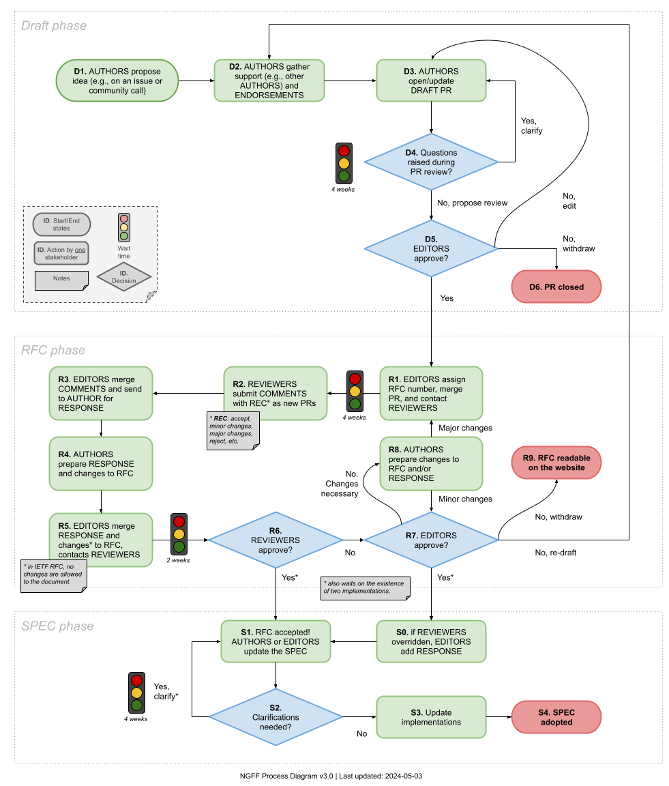

RFC Process
===========

.. toctree::
   :maxdepth: 1
   :hidden:

   1/template

The RFC process is defined in `RFC-1 <1/index.html>`_
and anyone interested in participating in the RFC
process should familiarize themselves with that text.

Relevant sections describing the phases depicted in
the diagram below include:

 * `DRAFT <1/index.html#draft>`_
 * `RFC <1/index.html#rfc>`_
 * `SPEC <1/index.html#spec>`_

A `template <1/template.html>`_ is available for the
creation of new RFCs.

The diagram below shows the
stages that an RFC progresses through.

