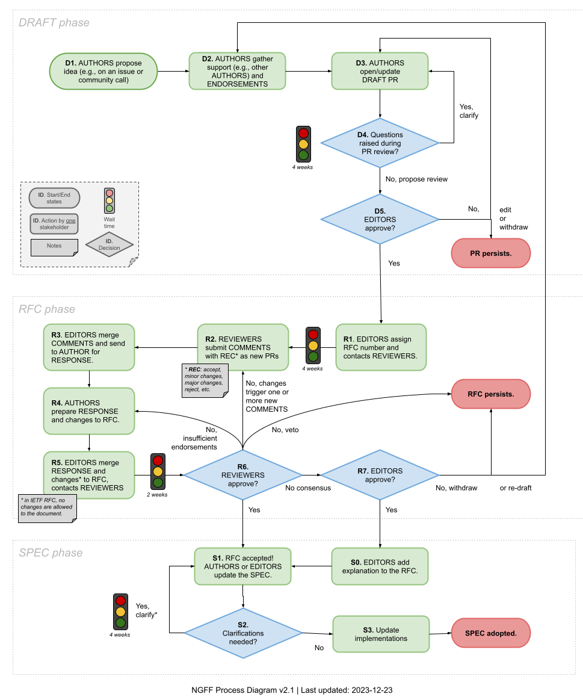

RFC Process
===========

.. toctree::
   :maxdepth: 1
   :hidden:

   x/template

The RFC process is defined in `RFC-x <x/index.html>`_
and anyone interested in participating in the RFC
process should familiarize themselves with that text.
A `template <x/template.html>`_ is available for the
creation of new RFCs. The diagram below shows the
stages that an RFC progresses through.

